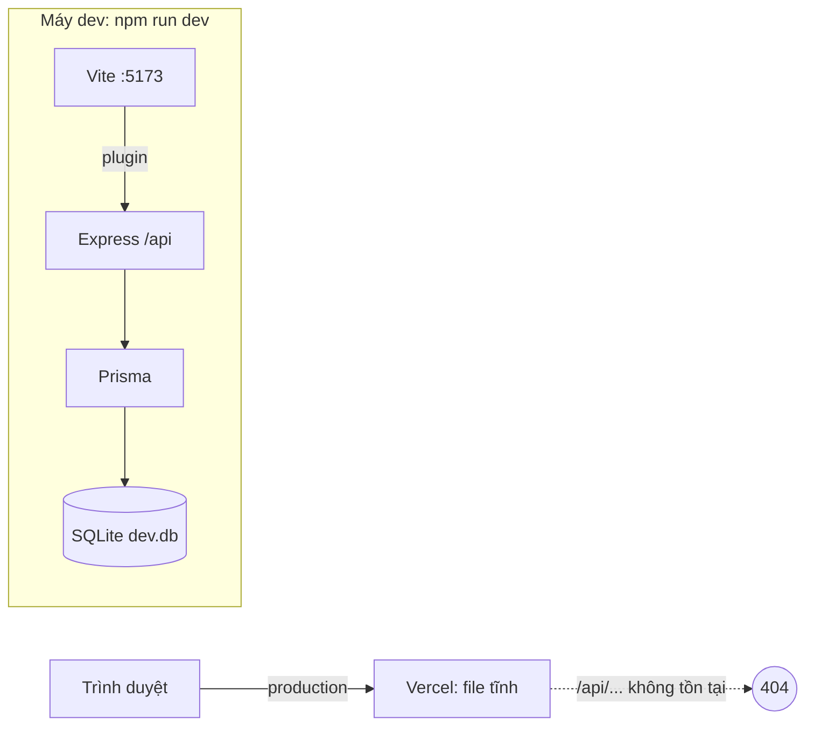
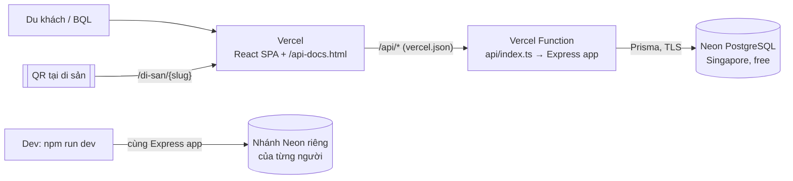
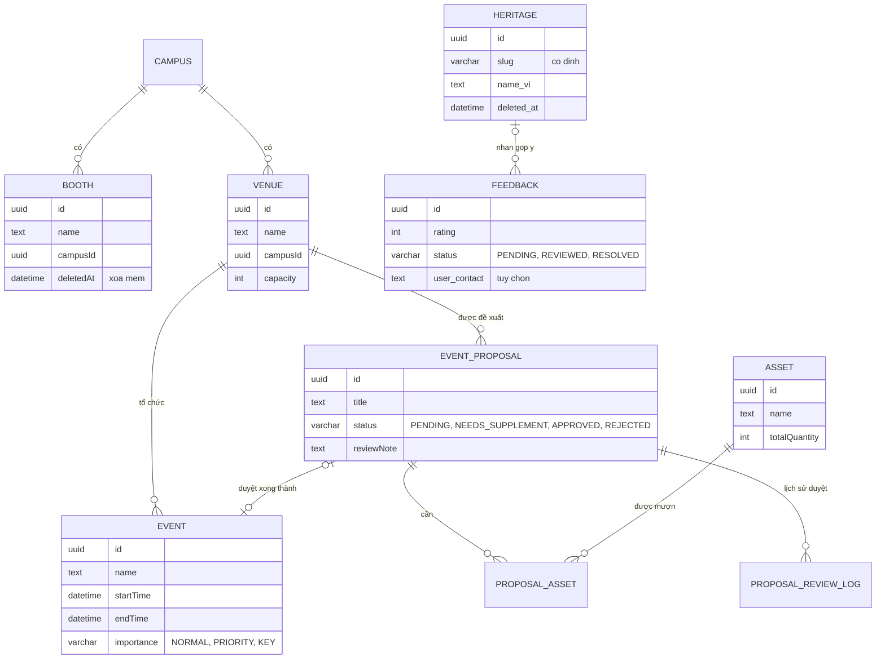
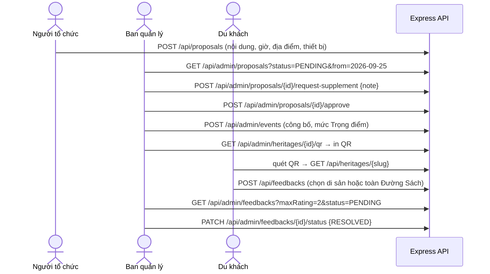

# 01 · Tổng quan hệ thống Đường Sách

> Cập nhật 19/09/2026 · Nguồn: repo `arisdo-29/duong-sach-project` (commit `57e2ced`), file yêu cầu mentor, Duong_Sach_Requirement.xlsm, đề xuất AIC Lab.

## 1. Bối cảnh nghiệp vụ

Đường Sách TP.HCM (Q1) và Đường Sách Thủ Đức cần website song ngữ và phần mềm quản lý. Mentor giao cho mỗi nhóm làm **đủ 3 phần API quản trị**:

| Phần | API | Requirement gốc |
|---|---|---|
| 1. Gian hàng & CSVC | booths, venues, assets | RQ02 gian hàng, RQ05 tài sản |
| 2. Sự kiện & hồ sơ | events, proposals (xem + duyệt) | RQ03 lịch sự kiện, RQ04 đăng ký tổ chức, RQ05 duyệt |
| 3. Di sản & feedback | heritages, QR, feedbacks | RQ06 CMS, RQ08 27 di sản + QR, RQ09 QR góp ý chung |

Giả định đã chốt trong file requirement: QR di sản trỏ URL ổn định, sửa nội dung không đổi QR (AS01); góp ý không bắt buộc đăng nhập, liên hệ tùy chọn (AS04); đề xuất là đăng ký tổ chức, không phải vé tham dự (RQ04).

## 2. Hiện trạng code

| Thành phần | Công nghệ | Trạng thái |
|---|---|---|
| Frontend | React 18 + Vite + TypeScript + Tailwind (bolt.new) | Đủ màn hình công khai + admin; phần lớn đọc **dữ liệu giả** `src/data/mockData.ts` |
| Backend | Node.js + Express 5 + TypeScript (`server/`) | 1 file `server/routes/admin.ts`: CRUD di sản, QR, danh sách/đổi trạng thái/tạo/xóa feedback. **Phần 1 và 2 chưa có API** |
| DB | Prisma 6.4 + SQLite (`prisma/dev.db` commit trong git) | 2 bảng Heritage, Feedback; seed 10 di sản |
| Deploy | Vercel | Chỉ có frontend tĩnh |

Backend hiện "ký sinh" trong Vite dev server (plugin `configureServer` trong `vite.config.ts`), nên chỉ chạy khi `npm run dev`. Trên Vercel **không có API** (suy ra từ code – kiểm tra bằng tab Network ở trang admin bản deploy).

## 3. Kiến trúc mục tiêu (đến 19:00 20/09)

Điểm mấu chốt: **một Express app dùng chung** (`server/app.ts`) cho cả dev (qua plugin Vite) lẫn production (qua `api/index.ts`). Frontend giữ nguyên lời gọi `/api/...` tương đối – không CORS, không sửa axios, mỗi PR có bản Preview đầy đủ cả API.

## 4. Mô hình dữ liệu

File đầy đủ, đã kiểm tra hợp lệ với Prisma 6.4 + PostgreSQL: [`schema-muc-tieu.prisma`](schema-muc-tieu.prisma).

Ghi chú về schema:
1. Trạng thái/mức độ để kiểu `String` + kiểm tra bằng zod (không dùng enum) → dễ đổi giá trị, schema chạy được trên nhiều loại DB.
2. Khóa ngoại dùng `onDelete: NoAction` → xóa bản ghi đang được tham chiếu sẽ bị DB chặn → API trả 409.
3. PostgreSQL lưu chuỗi UTF-8 → tiếng Việt đúng dấu. Lưu ý duy nhất: tìm kiếm phân biệt hoa thường, nên dùng `mode: 'insensitive'`.

## 5. Luồng nghiệp vụ chính

## 6. Vấn đề phát hiện trong code hiện tại

| # | Vấn đề | Ảnh hưởng | Xử lý ở |
|---|---|---|---|
| 1 | Backend chỉ chạy trong `vite dev` | Bản Vercel không có API | SETUP-01, DEVOPS-01 |
| 2 | Chưa có API phần 1 và phần 2 | Thiếu 6/9 nhóm API mentor yêu cầu | FR-01 → FR-06 |
| 3 | `GET /api/admin/feedbacks` chưa lọc theo di sản/điểm/trạng thái | Thiếu yêu cầu mentor | FR-09 |
| 4 | Góp ý "Toàn khu vực" bị gán vào di sản đầu tiên | Sai dữ liệu, sai thống kê | FR-10 |
| 5 | QR trỏ `/di-san/{slug}` nhưng frontend không đọc URL | Quét QR về trang chủ | FE-01 + SPA fallback |
| 6 | Domain QR mặc định `localhost:5173` nếu quên cấu hình | QR in ra vô dụng | FR-08 |
| 7 | PATCH feedback có "fallback id test" (`fb-…` → sửa bản ghi đầu tiên) | Sửa nhầm dữ liệu | FR-09 |
| 8 | Router admin mount 2 lần (`/api/admin` và `/api`) | API admin lộ ở 2 đường dẫn | SETUP-01 tách admin/public |
| 9 | Trả nguyên object lỗi (`details: error`) ra client | Lộ thông tin nội bộ | error-handler chung |
| 10 | Xóa di sản là xóa cứng, xóa luôn feedback | Mất dữ liệu, QR gãy | FR-07 xóa mềm |
| 11 | DB là SQLite (file trên máy) | Không deploy lên Vercel được | SETUP-01 chuyển sang PostgreSQL |
| 12 | `prisma/dev.db` (nhị phân) trong git; nhánh `webadmin` từng merge rồi revert, còn 1 commit treo; PR cũ còn mở; chưa có issue, nhãn, `.gitattributes` | Xung đột, merge nhầm | docs/04, CLEAN-01 |

## 7. Quyết định kiến trúc

**ADR-1 · Giữ TypeScript cho backend (không chuyển sang Java).**
- Phạm vi thật là 9 nhóm API trong chưa tới 1 ngày. Code TS đã có sẵn phần 3 (~70%), Prisma schema, seed, và cơ chế chạy chung với frontend.
- Một ngôn ngữ, một lần `npm install`, một nơi deploy (Vercel) cho cả nhóm. Không phải dựng JVM trên hosting miễn phí yếu (RAM 512 MB, khởi động chậm).
- Cả 4 người đều đã commit code TS vào repo; Nhóm 1 cũng dùng TS.
- Cái giá: không luyện được Spring trong đợt này. Bù lại bằng cách **tổ chức code theo lớp giống Spring** (routes/controller/service/schema) và bảng đối chiếu Spring ↔ Express ở docs/02 – kiến thức chuyển qua lại được. Nếu môn học bắt buộc Java, có thể port sau deadline theo đúng hợp đồng API này.

**ADR-2 · PostgreSQL (Neon) + code-first với Prisma.** Ban đầu nhóm chọn SQL Server trên Azure, nhưng Azure for Students cần email trường nên đổi sang Neon: miễn phí, không cần thẻ, mỗi người một nhánh database riêng nên không ai phải cài DB trên máy. Prisma che gần hết khác biệt giữa hai hệ quản trị: schema chỉ đổi `provider` và kiểu cột, code service giữ nguyên. `schema.prisma` là nguồn sự thật, nằm trong git, review được như code; `prisma db push` tự tạo bảng. Database-first bắt 4 người đồng bộ file `.sql` bằng tay. Sau deadline chuyển sang `prisma migrate` để có lịch sử migration.

**ADR-3 · Hạ tầng miễn phí:** Vercel (frontend + API Function, vùng `sin1` Singapore) + Neon PostgreSQL (vùng Singapore). Hai bên cùng vùng nên mỗi truy vấn chỉ mất vài mili-giây. Phương án dự phòng: docs/05.

**ADR-4 · Chia thư mục theo module, mỗi module một chủ;** schema và file đăng ký route do trưởng nhóm tạo trước → 4 người code song song gần như không xung đột.
