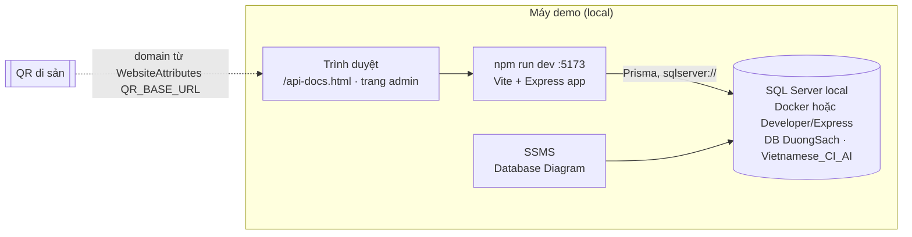
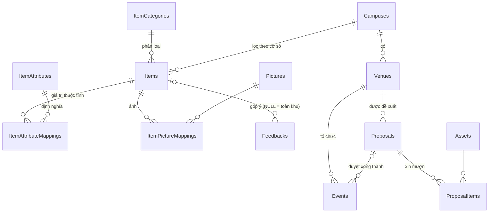
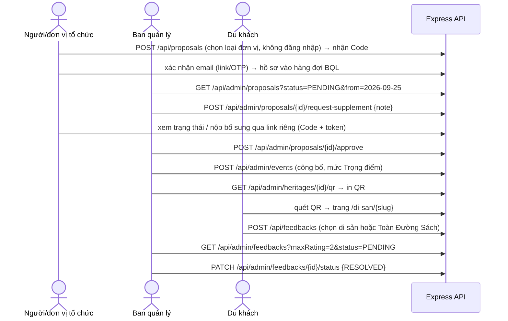

# 01 · Tổng quan hệ thống Đường Sách

> Cập nhật 21/09/2026 theo **hướng đi SQL Server** (tài liệu *Hướng đi dự án sau yêu cầu mới của mentor*). Thay thế toàn bộ bản 19/09 (PostgreSQL/Neon).

## 1. Bối cảnh nghiệp vụ

Đường Sách TP.HCM (Q1) và Đường Sách Thủ Đức cần website song ngữ và phần mềm quản lý. Yêu cầu mới của mentor:

1. Database **SQL Server**, thiết kế lại theo khuôn mẫu mentor gửi (Products, ProductCategories, ProductAttributes, ProductAttributeMappings, Pictures, ProductPictureMappings, WebsiteAttributes, Orders, OrderItems).
2. **9 API admin** chia 3 phần (mỗi phần 3 API). **Demo tối thiểu 3 API trên Swagger.** Không tính login/register.
3. Trường mô tả dùng **CKEditor 5**.
4. Mốc demo **19:30 ngày 22/09/2026**, chạy local được chấp nhận.

| Phần | API | Requirement gốc |
|---|---|---|
| 1. Gian hàng & CSVC | booths (FR-01), venues (FR-02), assets (FR-03) | RQ02 gian hàng, RQ05 tài sản |
| 2. Sự kiện & hồ sơ | events (FR-04), proposals xem (FR-05) + duyệt (FR-06) | RQ03 lịch, RQ04 đăng ký tổ chức, RQ05 duyệt |
| 3. Di sản & feedback | heritages (FR-07), QR (FR-08), feedbacks (FR-09) | RQ06 CMS, RQ08 27 di sản + QR, RQ09 QR góp ý |

Giả định trong file requirement vẫn giữ: QR di sản trỏ URL ổn định, sửa nội dung không đổi QR (AS01); góp ý không bắt buộc đăng nhập, liên hệ tùy chọn (AS04); đề xuất là đăng ký **tổ chức**, không phải vé tham dự (RQ04).

**Quy định tạm thời** (sửa lại nếu khách/BQL bổ sung): cá nhân được phép đề xuất tổ chức; "số lượng sách" của gian hàng hiểu là **số đầu sách**; giới hạn số đơn và quy mô theo loại đơn vị **chưa chốt** → để dạng cấu hình trong `WebsiteAttributes`, không hard-code.

## 2. Hiện trạng code (21/09, commit `841f787`)

| Thành phần | Trạng thái |
|---|---|
| Frontend React 18 + Vite + Tailwind | Đủ màn công khai + admin. Admin di sản/QR/feedback gọi API thật; phần còn lại đọc `src/data/mockData.ts` |
| Backend Express 5 + Prisma 6 + zod | Cấu trúc module chuẩn (routes/controller/service/schema/openapi). **Chạy thật:** heritages (FR-07), qr (FR-08), feedbacks (FR-09), campuses. **Khung trống (TODO):** booths, venues, assets, events, proposals |
| Database | PostgreSQL trên Neon (schema cũ, tên cột camelCase/snake_case) → **phải chuyển sang SQL Server** |
| Swagger | Viết tay theo module (`*.openapi.ts`), gộp ở `server/core/openapi.ts`, xem tại `/api-docs.html` |
| Deploy | Vercel vùng `sin1`, API chạy dạng Vercel Function (`api/index.ts`) |

`npm run dev` chạy **cả frontend lẫn API** (Vite nạp `server/app.ts` làm middleware). `npm run server` chỉ chạy API ở cổng 5000.

## 3. Kiến trúc cho buổi demo 22/09

Một Express app dùng chung (`server/app.ts`) cho cả dev (plugin Vite), `npm run server` và Vercel (`api/index.ts`). Deploy lên cloud là **tùy chọn** (docs/05 mục 8): cần một SQL Server trên cloud mà Vercel truy cập được.

## 4. Mô hình dữ liệu

Nguồn sự thật: [`prisma/schema.prisma`](../prisma/schema.prisma).

### 4.1 Nguyên tắc
- Trường dùng để **lọc, sắp xếp hoặc kiểm tra ràng buộc** → **cột thật** (CampusId, Capacity, TotalQuantity, StartTime, Status…).
- Trường **chỉ để hiển thị và khác nhau theo từng loại** → **thuộc tính động** (`ItemAttributes` + `ItemAttributeMappings`).
- Nội dung hiển thị cho du khách dùng **khung chung** (`Items`…); nghiệp vụ có quy tắc (lịch, duyệt, số lượng) dùng **bảng riêng**.

### 4.2 Quy tắc đặt tên (theo khuôn mentor)
- Bảng PascalCase, số nhiều, tiếng Anh. Phân loại `<Chủ thể>Categories`; định nghĩa thuộc tính `<Chủ thể>Attributes`; gán giá trị `<Chủ thể><Đối tượng>Mappings`; đầu–chi tiết `<Đầu>` + `<Đầu số ít>Items`.
- Khóa chính `Id`; khóa ngoại `<Thực thể>Id`.
- Cột theo mẫu mentor: `Name`, `Description`, `Slug`, `Content`; bản tiếng Anh thêm `Eng` (`NameEng`, `DescEng`, `ContentEng`); `MetaTitle`, `MetaKeywords`, `MetaDescription`; `DateCreated`, `LastEditedTime`; `Deleted` (xóa mềm); `DisplayOrder`, `Position`, `IsRequired`, `IsMainPicture`, `IsPublic`, `ControlType`, `Value`.
- Trong Prisma: **model số ít + `@@map` số nhiều**, **cột PascalCase viết thẳng**. Ví dụ `model Item { … @@map("Items") }` → code gọi `prisma.item.findMany({ where: { Deleted: false } })`.
- Tiền tố chủ thể **Item** (di sản, gian hàng không phải "sản phẩm"). Nếu mentor muốn giữ chữ Product: chỉ đổi tiền tố, cấu trúc giữ nguyên (câu hỏi mở, hỏi khi demo).
- Bổ sung so với mẫu: cột `Code` ở `ItemAttributes` (mã cố định để code tra cứu, vì `Name` là nhãn có thể sửa).

### 4.3 Khung nội dung chung

| Bảng | Tương ứng mẫu | Vai trò và cột chính |
|---|---|---|
| `ItemCategories` | ProductCategories | Loại nội dung, tra bằng `Slug`: `di-san`, `gian-hang`, `tien-ich`, `gioi-thieu`. Cột: Name, NameEng, Description, Slug, Position, Notes |
| `Items` | Products | Nội dung hiển thị: Name/NameEng, Description/DescEng, **Content/ContentEng (HTML CKEditor, NVarChar(Max))**, Slug (duy nhất; cố định với di sản), Meta\*, DateCreated, LastEditedTime, ItemCategoryId, **CampusId** (cột thật để lọc), IsHomePage, DisplayOrder, **Deleted** |
| `ItemAttributes` | ProductAttributes | Định nghĩa thuộc tính: Code, Name, NameEng, Description, ControlType (`text`, `number`, `textbox`, `editor`, `select`, `date`), ItemCategoryId (thuộc tính của loại nào) |
| `ItemAttributeMappings` | ProductAttributeMappings | Giá trị cho từng Item: ItemId, ItemAttributeId, Value, IsRequired, DisplayOrder. Duy nhất theo (ItemId, ItemAttributeId) |
| `Pictures` | Pictures | Ảnh: Url, MimeType, Description; Binary để NULL (ưu tiên URL) |
| `ItemPictureMappings` | ProductPictureMappings | Gán ảnh: ItemId, PictureId, Title, DisplayOrder, **IsMainPicture** |
| `WebsiteAttributes` | WebsiteAttributes | Cấu hình key–value: Name (khóa), Description, ControlType, Type, Value, IsPublic, Deleted, Text_1..Text_3 |

Thuộc tính seed sẵn (tra bằng `Code`):

| Code | Loại | ControlType | Ý nghĩa |
|---|---|---|---|
| `SOURCE` | di-san | text | Nguồn tư liệu di sản |
| `OWNER` | gian-hang | text | Đơn vị sở hữu (NXB Trẻ, Nhã Nam…) |
| `LOCATION` | gian-hang | text | Vị trí / mã gian ("Gian 12") |
| `BOOK_TITLE_COUNT` | gian-hang | number | Số **đầu sách** (tạm thời) |
| `TOPIC` | gian-hang | text | Chủ đề sách |
| `LAT`, `LNG` | tien-ich | number | Tọa độ điểm bản đồ |

Cấu hình seed sẵn trong `WebsiteAttributes` (tra bằng `Name`):

| Name | Type | Giá trị mẫu | Ghi chú |
|---|---|---|---|
| `QR_BASE_URL` | qr | `http://localhost:5173` | Domain sinh QR. Rỗng → dùng env `PUBLIC_BASE_URL` |
| `OPENING_HOURS` | contact | `07:30 – 22:00` | IsPublic = true |
| `HOTLINE` | contact | `…` | IsPublic = true |
| `PROPOSAL_MAX_PER_EMAIL_PER_DAY` | proposal | *(rỗng)* | Rỗng = chưa giới hạn (khách chưa chốt) |
| `PROPOSAL_MAX_PER_IP_PER_DAY` | proposal | *(rỗng)* | như trên |
| `PROPOSAL_MAX_ATTENDEES_<LOẠI ĐƠN VỊ>` | proposal | *(rỗng)* | Quy mô theo loại đơn vị – chưa chốt |

### 4.4 Bảng nghiệp vụ riêng

Tổng cộng **14 bảng**: 7 bảng khung nội dung (mục 4.3) + 7 bảng dưới đây. Trong đó `Proposals` + `ProposalItems` chính là cặp `Orders` + `OrderItems` của khuôn mentor. Vì sao không tách bảng tổ chức và lịch sử duyệt: xem ADR-7.

| Bảng | Tương ứng mẫu | Vai trò |
|---|---|---|
| `Campuses` | – | Cơ sở `HCM`, `THU_DUC` (seed, chỉ đọc) |
| `Venues` | – | Địa điểm, **Capacity** (cột thật để kiểm tra sức chứa) |
| `Assets` | – | Thiết bị, **TotalQuantity** (cột thật để kiểm tra thiếu thiết bị) |
| `Events` | – | Sự kiện đã công bố: StartTime, EndTime, VenueId, Importance (`NORMAL`/`PRIORITY`/`KEY`), Description (HTML), ProposalId nếu sinh từ hồ sơ |
| `Proposals` | Orders | Hồ sơ đề xuất. **Người/đơn vị nộp** lưu thẳng trên hồ sơ (như thông tin người nhận trên Orders): OrganizerType (`ca-nhan`/`doanh-nghiep`/`truong-hoc`/`clb-cong-dong`), OrganizerName, RepresentativeName, Email, Phone, TaxCode (chỉ doanh nghiệp). **Nội dung:** Code (mã tra cứu), Title, Description (HTML), thời gian, VenueId, ExpectedAttendees. **Duyệt:** Status, ReviewNote, ReviewedAt, ReviewedBy (lần gần nhất). **Kiểm soát đơn:** AccessTokenHash, EmailVerifyTokenHash, EmailVerifiedAt, SubmitterIp |
| `ProposalItems` | OrderItems | Thiết bị xin mượn: ProposalId, AssetId, Quantity |
| `Feedbacks` | – | Góp ý: ItemId (NULL = Toàn Đường Sách), Rating, Content, Status, UserContact (tùy chọn) |

### 4.5 Ánh xạ 9 API vào bảng

| API | Bảng | Ghi chú ánh xạ JSON ↔ cột |
|---|---|---|
| FR-01 gian hàng | `Items` (loại `gian-hang`) + `ItemAttributeMappings` + `ItemPictureMappings` | `name`→Name, `campusId`→CampusId, `description`→Content (HTML), `owner`/`location`/`bookCount`/`topic` → thuộc tính `OWNER`/`LOCATION`/`BOOK_TITLE_COUNT`/`TOPIC`, `imageUrl`→ảnh chính, xóa → `Deleted = true` |
| FR-02 địa điểm | `Venues` | Xóa cứng; đang được tham chiếu → 409 |
| FR-03 thiết bị | `Assets` | như trên |
| FR-04 sự kiện | `Events` | `description` là HTML |
| FR-05, FR-06 hồ sơ | `Proposals` + `ProposalItems` (+ `Venues`, `Assets`) | `organizerName`→OrganizerName, `organizerType`→OrganizerType, `organizerContact`→Email / Phone; chỉ hồ sơ có `EmailVerifiedAt`; duyệt ghi Status, ReviewNote, ReviewedAt, ReviewedBy; trả bổ sung / từ chối bắt buộc ghi chú |
| FR-07 di sản | `Items` (loại `di-san`) + `ItemPictureMappings` + thuộc tính `SOURCE` | `name_vi`→Name, `name_en`→NameEng, `content_vi`→Content, `content_en`→ContentEng, `image_url`→ảnh chính, `source`→`SOURCE`, `deleted_at`→Deleted, `created_at`→DateCreated, `updated_at`→LastEditedTime, `_count.feedbacks` → đếm `Feedbacks` |
| FR-08 QR | `Items.Slug` + `WebsiteAttributes.QR_BASE_URL` | Rỗng thì dùng env `PUBLIC_BASE_URL` |
| FR-09 feedback | `Feedbacks` | Lọc theo ItemId (Id / slug / `general` = NULL), điểm, trạng thái. `heritage_id`→ItemId, `user_contact`→UserContact |

### 4.6 Điểm kỹ thuật SQL Server (đã áp dụng trong schema)
1. Chuỗi dùng `@db.NVarChar(n)`; nội dung dài/HTML dùng `@db.NVarChar(Max)` (`String` mặc định chỉ `nvarchar(1000)`). Không dùng `VarChar` (tiếng Việt lỗi).
2. Không `enum`, không `Json`. Trạng thái là `NVarChar` + zod.
3. Mọi quan hệ `onDelete: NoAction, onUpdate: NoAction` → không vướng lỗi *multiple cascade paths*; xóa bản ghi đang được tham chiếu bị DB chặn → API trả 409 (P2003).
4. Không `@unique` trên cột nullable (SQL Server coi các NULL là trùng). Vì vậy `Events.ProposalId` chỉ có index, không unique.
5. Không có `mode: 'insensitive'`. Database tạo với collation **`Vietnamese_CI_AI`** → so sánh chuỗi không phân biệt hoa thường **và dấu** ("nha nam" tìm ra "Nhã Nam").
6. Không có `directUrl`; một biến `DATABASE_URL` dạng `sqlserver://`.

## 5. Luồng nghiệp vụ chính

## 6. Vấn đề cần xử lý khi chuyển sang SQL Server

| # | Vấn đề | Xử lý ở |
|---|---|---|
| 1 | `schema.prisma` đang là PostgreSQL (`directUrl`, `@db.VarChar`, `String` không giới hạn cho nội dung dài) | DB-01 |
| 2 | `feedbacks.service.ts` dùng `mode: 'insensitive'` (SQL Server không hỗ trợ → lỗi typecheck) | DB-01 |
| 3 | `Event.proposalId @unique` trên cột nullable → lỗi khi có từ 2 sự kiện không sinh từ hồ sơ | DB-01 (bỏ unique, quan hệ 1-n) |
| 4 | Tên bảng/cột chưa theo khuôn mentor | DB-02 |
| 5 | Góp ý "Toàn khu vực" bị gán vào di sản đầu tiên (TODO #17 trong code) | FR-09 (ItemId = NULL) |
| 6 | Domain QR chỉ đọc env | FR-08 (WebsiteAttributes trước, env dự phòng) |
| 7 | Nội dung HTML chưa sanitize | CORE-01 + mọi service lưu HTML |
| 8 | `prisma/dev.db` (SQLite cũ) còn trong git; `@supabase/supabase-js`, `.bolt/` không dùng | DB-01 xóa dev.db; CLEAN-02 |
| 9 | `.env.example` dùng chuỗi PostgreSQL (CI đã tự chọn URL theo provider từ bộ kit 21/09) | DB-01 |
| 10 | `http/*.http`, `e2e/` viết cho dữ liệu cũ | QA-02 |

## 7. Quyết định kiến trúc

**ADR-1 · Giữ TypeScript cho backend (không chuyển sang Java).** Không đổi so với bản trước: code đã chạy, một ngôn ngữ, một lần `npm install`. Code tổ chức theo lớp giống Spring và có bảng đối chiếu ở docs/02.

**ADR-2 · SQL Server + code-first với Prisma (thay PostgreSQL/Neon).** Mentor yêu cầu SQL Server. Prisma hỗ trợ `provider = "sqlserver"` nên tầng service gần như giữ nguyên; `schema.prisma` vẫn là nguồn sự thật, `prisma db push` tự tạo bảng. Ràng buộc cũ vẫn còn: Azure SQL miễn phí cần email trường hoặc thẻ → **demo chạy SQL Server local** (Docker hoặc bản Developer/Express miễn phí), deploy tính sau (docs/05 mục 8). Sau `db push`, dùng **SSMS → Database Diagrams** để trình bày sơ đồ đúng kiểu hình mentor gửi.

**ADR-3 · Mô hình kết hợp: khung nội dung chung + bảng nghiệp vụ riêng.** Nội dung hiển thị (di sản, gian hàng, điểm bản đồ) dùng khung `Items`/`Attributes`/`Pictures` theo mẫu mentor → thêm loại nội dung hay thêm trường hiển thị không phải sửa schema. Nghiệp vụ có quy tắc (sức chứa, số lượng thiết bị, lịch, duyệt hồ sơ) dùng bảng riêng với cột thật → kiểm tra ràng buộc bằng khóa ngoại và truy vấn đơn giản. Cái giá: service phải ánh xạ JSON ↔ thuộc tính động (đã gom vào `core/items.ts`).

**ADR-4 · Giữ nguyên hợp đồng API.** Đổi DB không đổi JSON: frontend (HeritageManager, HeritageQR, FeedbackTable, FeedbackForm) và `*.openapi.ts` gần như không phải sửa. Ánh xạ nằm trong `toDto()` của từng service.

**ADR-5 · Đăng ký tổ chức: form không đăng nhập + lớp kiểm soát.** Bước duyệt của BQL là chốt kiểm soát chính; xác nhận email, giới hạn số đơn (đọc từ `WebsiteAttributes`), captcha khi cần chỉ để giảm đơn rác. Cổng tài khoản cho đơn vị tổ chức để sau (lúc đó tách bảng `Organizers`, xem ADR-7).

**ADR-6 · Chia thư mục theo module, mỗi module một chủ;** schema, seed, helper core do trưởng nhóm làm trước → 4 người code song song gần như không xung đột.

**ADR-7 · Gọn còn 14 bảng: thông tin người nộp nằm trên `Proposals`, chỉ lưu lần duyệt gần nhất.** Bản nháp đầu có 19 bảng, trong đó 4 bảng `Organizer*` dựng lại cả một khung thuộc tính động thứ hai chỉ để lưu thông tin người nộp, và `ProposalReviewLogs` trùng một phần với `ReviewNote`/`ReviewedAt`. Ở giai đoạn này chưa có đăng nhập cho đơn vị tổ chức nên mỗi hồ sơ tự mang thông tin liên hệ – giống `Orders` lưu thông tin người nhận. Trường riêng theo loại đơn vị hiện chỉ có mã số thuế → một cột `TaxCode` nullable, zod bắt buộc khi loại là doanh nghiệp. Cái giá: một đơn vị nộp nhiều hồ sơ phải nhập lại thông tin; chỉ biết lần duyệt gần nhất. **Mở rộng sau:** khi có cổng tài khoản → thêm bảng `Organizers`, thêm cột `OrganizerId` (nullable) vào `Proposals` rồi chuyển dữ liệu; khi cần kiểm toán → thêm `ProposalReviewLogs`. Cả hai đều là **thêm bảng**, không phá dữ liệu cũ.
