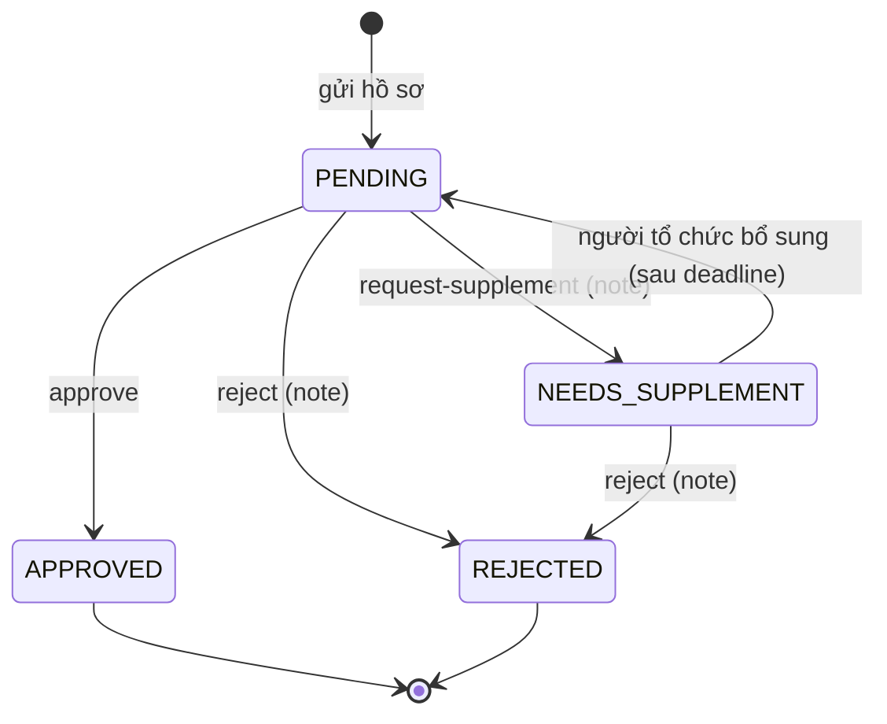

# 02 · Requirement, mức ưu tiên & hợp đồng API

> Nguồn sự thật cho issue là `.github/backlog.json`. Bảng dưới được sinh từ file đó – sửa backlog thì cập nhật bảng.

## 1. Mức ưu tiên

| Mức | Ý nghĩa | Quy tắc |
|---|---|---|
| **P0** | Mentor chấm – thiếu là không đạt | Phải merge + chạy trên bản deploy trước **16:00 20/09** |
| **P1** | Làm hệ thống dùng được thật (API public, test, demo) | Chỉ bắt đầu khi P0 của mình đã mở PR |
| **P2** | Điểm cộng "làm thêm" | Chỉ làm khi toàn bộ P0 đã merge |
| **P3** | Để sau deadline | Không làm trong ngày 20/09 |

Nguyên tắc cắt giảm khi trễ: mỗi nhóm API phải có **ít nhất danh sách + tạo mới** chạy được trước khi ai đó làm tiếp phần sửa/xóa/lọc nâng cao.

## 2. Danh sách đầu việc

Vai trò: A = trưởng nhóm (core, deploy) · B = phần 3 · C = booths, venues, events · D = assets, proposals.

| Mã | Ưu tiên | Phần | Đầu việc | Phụ trách | Ước lượng | Phụ thuộc |
|---|---|---|---|---|---|---|
| `SETUP-01` | P0 | core | Chuẩn hóa backend TypeScript: schema PostgreSQL + cấu trúc module + core | A | 2h | — |
| `SETUP-02` | P0 | — | Chuẩn bị môi trường dev cho từng thành viên | Cả nhóm | 0.5h | — |
| `DEVOPS-01` | P0 | — | Deploy: Neon PostgreSQL (free) + API chạy trên Vercel Functions | A | 1.5h | SETUP-01 |
| `FR-01` | P0 | 1 | CRUD gian hàng /api/admin/booths (xóa mềm, tìm theo tên, lọc theo cơ sở) | C | 2h | SETUP-01 |
| `FR-02` | P0 | 1 | CRUD địa điểm tổ chức /api/admin/venues (tên, cơ sở, sức chứa) | C | 1h | SETUP-01 |
| `FR-03` | P0 | 1 | CRUD thiết bị /api/admin/assets (tên, tổng số lượng) | D | 1h | SETUP-01 |
| `FR-04` | P0 | 2 | CRUD sự kiện /api/admin/events (tên, thời gian, địa điểm, mô tả, mức quan trọng) | C | 1.5h | SETUP-01 |
| `FR-05` | P0 | 2 | Xem hồ sơ đề xuất GET /api/admin/proposals, /{id} (lọc trạng thái, ngày) | D | 1.5h | SETUP-01 |
| `FR-06` | P0 | 2 | Duyệt hồ sơ: POST /api/admin/proposals/{id}/approve | request-supplement | reject | D | 2h | FR-05 |
| `FR-07` | P0 | 3 | CRUD di sản /api/admin/heritages (slug cố định, VI/EN, ảnh, nguồn) | B | 1h | SETUP-01 |
| `FR-08` | P0 | 3 | Sinh QR di sản GET /api/admin/heritages/{id}/qr (domain từ cấu hình) | B | 0.5h | SETUP-01 |
| `FR-09` | P0 | 3 | Quản lý feedback: lọc theo di sản, điểm, trạng thái + PATCH /{id}/status | B | 1.5h | SETUP-01 |
| `FR-10` | P1 | 3 | API public cho du khách: GET /api/heritages/{slug}, POST /api/feedbacks | B | 1h | FR-07, FR-09 |
| `FR-11` | P1 | 2 | API public gửi hồ sơ đề xuất POST /api/proposals | D | 0.5h | FR-05 |
| `QA-01` | P1 | — | Test E2E toàn bộ API trên bản deploy | A | 1h | DEVOPS-01 |
| `DOC-01` | P1 | — | Kịch bản demo + báo cáo công việc + luyện Q&A | A | 1h | DEVOPS-01 |
| `FR-12` | P2 | 2 | Duyệt hồ sơ → tự tạo sự kiện + cảnh báo trùng lịch / thiếu thiết bị | D | 1.5h | FR-06, FR-04 |
| `FR-13` | P2 | 3 | Thống kê feedback GET /api/admin/feedbacks/stats | B | 1h | FR-09 |
| `FR-14` | P2 | 3 | Tải QR PNG / ZIP QR tất cả di sản (phục vụ in 27 QR) | B | 1h | FR-08 |
| `FE-01` | P2 | 3 | Frontend: quét QR mở đúng trang /di-san/{slug} | B | 1.5h | FR-10 |
| `FE-02` | P2 | — | Frontend: nối màn admin gian hàng / sự kiện / hồ sơ với API thật | Ai rảnh | 2h | FR-01, FR-04, FR-05 |
| `NFR-01` | P3 | core | Bảo vệ /api/admin/** bằng header X-Admin-Key (tùy chọn) | A | 1h | DEVOPS-01 |
| `CLEAN-01` | P3 | — | Dọn dẹp sau demo: dev.db, dependency thừa, nhánh cũ | A | 0.5h | — |

Tiêu chí chấp nhận chi tiết của từng mã nằm trong issue tương ứng (sinh tự động từ backlog).

## 3. Quy ước code backend

### Cấu trúc một module (ví dụ `booths`)

```
server/modules/booths/
├── booths.routes.ts       router.get('/', validate({ query: listQuery }), controller.list)
├── booths.controller.ts   export async function list(req, res) { res.json(await service.list(req.query)) }
├── booths.service.ts      nghiệp vụ + prisma.booth.findMany(...)
├── booths.schema.ts       zod: createBooth, updateBooth, listQuery
└── booths.openapi.ts      mô tả endpoint cho /api-docs.html
http/booths.http           request mẫu để test
```

### Đối chiếu Spring Boot ↔ dự án này (dùng khi trả lời mentor)

| Spring Boot | Dự án (TypeScript) |
|---|---|
| `@RestController` + `@RequestMapping` | `<module>.routes.ts` (express.Router) + `<module>.controller.ts` |
| `@Service` | `<module>.service.ts` |
| `JpaRepository` / Hibernate | Prisma Client (`prisma.booth.findMany`) |
| `@Entity` | `model` trong `prisma/schema.prisma` |
| DTO + `@Valid` + `@NotBlank` | zod schema trong `<module>.schema.ts` + middleware `validate` |
| `@ControllerAdvice` | `server/core/error-handler.ts` |
| `application.yml` / profiles | `.env` + `server/core/config.ts` |
| `ddl-auto=update` / Flyway | `prisma db push` / `prisma migrate` |
| springdoc Swagger UI | `<module>.openapi.ts` + `/api-docs.html` |
| `@Transactional` | `prisma.$transaction([...])` |
| `JpaSpecificationExecutor` (lọc động) | ghép object `where` của Prisma theo query |

## 4. Hợp đồng API

### Quy ước chung
- Base: `/api/admin/*` (quản trị), `/api/*` (công khai). JSON UTF-8. ID là UUID.
- Thành công: 200 (đọc/sửa/xóa), 201 (tạo). Danh sách trả **mảng**.
- Lỗi: `{ "error": "Thông báo tiếng Việt", "code": "VALIDATION_ERROR" | "NOT_FOUND" | "CONFLICT" | "BAD_REQUEST" | "INTERNAL", "details": [{ "path": "name", "message": "..." }] }` với status 400/404/409/500.
- Thời gian ISO-8601 (`2026-09-27T09:00:00+07:00`). Bộ lọc `from`/`to` dạng `YYYY-MM-DD` theo giờ Việt Nam.

### Phần 1 – Gian hàng & CSVC
```jsonc
// POST /api/admin/booths
{ "name": "Nhã Nam", "campusId": "HCM", "owner": "Công ty Nhã Nam", "location": "Gian 12",
  "description": "Văn học dịch", "bookCount": 1200, "imageUrl": "https://..." }
// 201 → Booth
{ "id": "uuid", "name": "Nhã Nam", "campusId": "uuid", "campus": { "id": "uuid", "code": "HCM", "name": "Đường Sách TP.HCM" },
  "owner": "Công ty Nhã Nam", "location": "Gian 12", "description": "...", "bookCount": 1200,
  "imageUrl": "https://...", "createdAt": "...", "updatedAt": "..." }
// GET /api/admin/booths?q=nha&campusId=HCM → Booth[] (không gồm gian hàng đã xóa mềm)
// DELETE /api/admin/booths/{id} → { "message": "Đã xóa gian hàng", "id": "uuid" }

// POST /api/admin/venues
{ "name": "Sân khấu chính", "campusId": "HCM", "capacity": 200, "description": "..." }
// DELETE venue đang có sự kiện → 409 { "error": "Địa điểm đang được sự kiện/hồ sơ sử dụng", "code": "CONFLICT" }

// POST /api/admin/assets
{ "name": "Loa kéo", "totalQuantity": 4, "unit": "cái" }
```

### Phần 2 – Sự kiện & hồ sơ đề xuất
```jsonc
// POST /api/admin/events
{ "name": "Giao lưu tác giả", "startTime": "2026-09-27T09:00:00+07:00", "endTime": "2026-09-27T11:00:00+07:00",
  "venueId": "uuid", "description": "...", "importance": "KEY" }
// 201 → { ...event, "importanceLabel": "Trọng điểm", "venue": { "id": "uuid", "name": "Sân khấu chính", "campus": {...} } }

// GET /api/admin/proposals?status=PENDING&from=2026-09-20&to=2026-09-30&dateField=startTime
[{ "id": "uuid", "title": "Workshop làm sách tranh", "organizerName": "CLB Đọc sách FPT", "status": "PENDING",
   "statusLabel": "Chờ duyệt", "startTime": "...", "endTime": "...", "venue": { "id": "uuid", "name": "..." }, "submittedAt": "..." }]
// GET /api/admin/proposals/{id} → thêm "description", "organizerContact", "expectedAttendees",
//   "assets": [{ "assetId": "uuid", "name": "Loa kéo", "quantity": 2, "totalQuantity": 4 }], "reviewLogs": [...]

// POST /api/admin/proposals/{id}/request-supplement   (note BẮT BUỘC; reject cũng vậy)
{ "note": "Bổ sung danh sách diễn giả và kịch bản chương trình" }
// 200 → proposal với status "NEEDS_SUPPLEMENT", reviewNote, reviewedAt
// thiếu note → 400; hồ sơ đã APPROVED/REJECTED → 409
```

Máy trạng thái hồ sơ:


### Phần 3 – Di sản & feedback (giữ field cũ cho frontend)
```jsonc
// Heritage (HeritageManager.tsx đang dùng đúng các field này)
{ "id": "uuid", "slug": "nha-tho-duc-ba", "name_vi": "Nhà thờ Đức Bà", "name_en": "Notre-Dame Cathedral",
  "content_vi": "...", "content_en": "...", "image_url": "https://...", "source": "...",
  "created_at": "...", "updated_at": "...", "_count": { "feedbacks": 3 } }
// PUT gửi "slug" khác → 400 "Slug không được thay đổi"

// GET /api/admin/heritages/{id|slug}/qr?size=300  (HeritageQR.tsx)
{ "url": "https://duong-sach-project.vercel.app/di-san/nha-tho-duc-ba", "qrCode": "data:image/png;base64,...",
  "heritage": { "id": "uuid", "slug": "nha-tho-duc-ba", "name_vi": "...", "name_en": "..." } }

// GET /api/admin/feedbacks?heritageId=general|<id>|<slug>&status=PENDING&minRating=1&maxRating=2  (FeedbackTable.tsx)
[{ "id": "uuid", "content": "...", "rating": 2, "status": "PENDING", "createdAt": "2026-09-19 14:30",
   "scope": "Nhà thờ Đức Bà" /* hoặc "Toàn Đường Sách" */, "contact": "", "heritage_id": "uuid" /* hoặc null */,
   "heritage": { "id": "uuid", "slug": "...", "name_vi": "...", "name_en": "..." } /* hoặc null */ }]
// PATCH /api/admin/feedbacks/{id}/status  { "status": "RESOLVED" } → { "message": "...", "feedback": {...} }

// Public: POST /api/feedbacks (FeedbackForm.tsx)
{ "content": "Cần thêm biển chỉ dẫn", "rating": 4, "contact": "", "scope": "Toàn khu vực Đường Sách" }
```

## 5. Ngoài phạm vi đợt này
Đăng nhập/phân quyền thật, chatbot AI (RQ10), passport (RQ11), dashboard đầy đủ (RQ12), upload ảnh (dùng URL ảnh).
