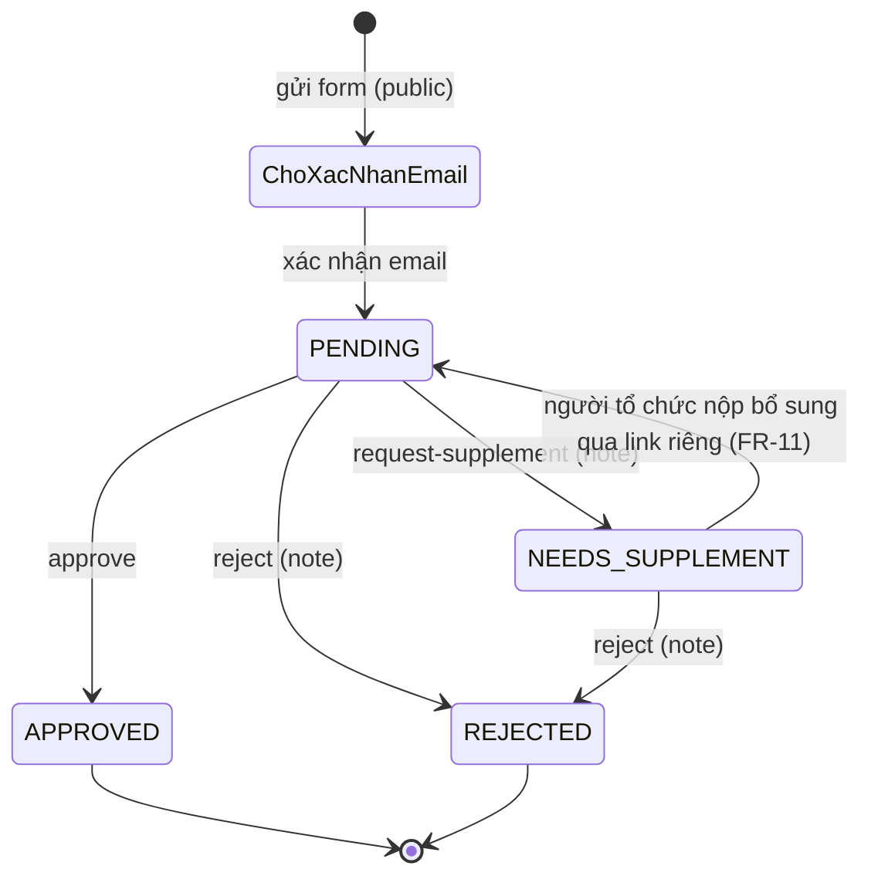

# 02 · Requirement, mức ưu tiên & hợp đồng API

> Cập nhật 21/09/2026 (hướng đi SQL Server). Nguồn sự thật cho issue là `.github/backlog.json`; bảng dưới sinh từ file đó – sửa backlog thì cập nhật bảng.
> **Hợp đồng JSON ở mục 4 giữ nguyên như bản cũ** (chỉ bổ sung vài trường mới, đánh dấu *mới*). Đổi DB không đổi API.

## 1. Mức ưu tiên

| Mức | Ý nghĩa | Quy tắc |
|---|---|---|
| **P0** | Đường găng buổi demo: SQL Server chạy được + **3 API demo** (FR-07, FR-08, FR-09) + kịch bản demo | Merge trước **13:30 22/09**. Trễ là ảnh hưởng buổi demo |
| **P1** | 6 API còn lại (FR-01 → FR-06), CKEditor, rà test | Làm song song, **không chặn demo**. Xong trước 19:30 thì demo thêm |
| **P2** | Deploy cloud, API public (đăng ký tổ chức, tra di sản), dọn dẹp | Chỉ làm khi P0 đã merge và P1 của mình đã mở PR |
| **P3** | Để sau buổi demo | Không làm trước 19:30 22/09 (có trong backlog dạng `stretch`) |

Nguyên tắc cắt giảm khi trễ: mỗi API phải có **danh sách + tạo mới** chạy được trên Swagger trước khi làm sửa/xóa/lọc nâng cao.

## 2. Danh sách đầu việc (milestone "Demo mentor – 19:30 22/09/2026")

Vai trò: A = Khuyên (trưởng nhóm: schema, core, seed, tài liệu DB, deploy) · B = Tân (Phần 3) · C = Trí (booths, venues, events) · D = Trâm (assets, proposals).

| Mã | Ưu tiên | Phần | Đầu việc | Phụ trách | Ước lượng | Phụ thuộc | Thay issue cũ |
|---|---|---|---|---|---|---|---|
| `SETUP-03` | P0 | — | Cài SQL Server local + công cụ xem DB, chạy được dự án theo docs/05 | Cả nhóm | 1h | — | #6 |
| `DB-01` | P0 | core | Chuyển Prisma sang SQL Server với **schema cũ** (bản dự phòng) | A | 1h | — | — |
| `DB-02` | P0 | core | Schema mới theo khuôn mentor + seed mới + cập nhật campuses | A | 2h | DB-01 | — |
| `CORE-01` | P0 | core | Helper dùng chung: `settings.ts` (WebsiteAttributes), `items.ts` (thuộc tính/ảnh Item), `html.ts` (sanitize) + cài thư viện CKEditor, sanitize-html | A | 1h | DB-02 | — |
| `FR-07` | P0 | 3 | CRUD di sản trên `Items` (giữ hợp đồng JSON) | B | 1.5h | DB-02, CORE-01 | (#14 đã xong trên schema cũ) |
| `FR-08` | P0 | 3 | QR: domain từ `WebsiteAttributes.QR_BASE_URL`, dự phòng `PUBLIC_BASE_URL` | B | 0.5h | FR-07 | (#15) |
| `FR-09` | P0 | 3 | Feedback trên `Feedbacks` mới + `POST /api/feedbacks` (góp ý chung → ItemId NULL) | B | 1h | FR-07 | (#16), một phần #17 |
| `DEMO-01` | P0 | — | Kịch bản demo Swagger + Database Diagram + luyện Q&A | A | 1h | FR-07, FR-08, FR-09 | #20 |
| `FR-01` | P1 | 1 | CRUD gian hàng trên `Items` (xóa mềm, tìm tên, lọc cơ sở) | C | 2h | DB-02, CORE-01 | #8 |
| `FR-02` | P1 | 1 | CRUD địa điểm `Venues` | C | 1h | DB-02 | #9 |
| `FR-04` | P1 | 2 | CRUD sự kiện `Events` | C | 1.5h | DB-02 | #11 |
| `FR-03` | P1 | 1 | CRUD thiết bị `Assets` | D | 1h | DB-02 | #10 |
| `FR-05` | P1 | 2 | Xem hồ sơ đề xuất (lọc trạng thái, ngày) | D | 1.5h | DB-02 | #12 |
| `FR-06` | P1 | 2 | Duyệt hồ sơ approve / request-supplement / reject | D | 2h | FR-05 | #13 |
| `FE-03` | P1 | 3 | CKEditor 5 cho trường nội dung ở màn admin di sản (component dùng chung) | B | 1.5h | CORE-01, FR-07 | — |
| `QA-02` | P1 | — | Rà `http/*.http` + `e2e/` sau đổi schema; chạy thử toàn bộ trên máy demo | A | 1h | FR-07, FR-08, FR-09 | #19 |
| `DEVOPS-02` | P2 | — | Deploy: SQL Server trên cloud + Vercel (chỉ khi 3 API demo ổn local) | A | 2h | DEMO-01 | — |
| `FR-10` | P2 | 3 | API public `GET /api/heritages/{slug}` | B | 0.5h | FR-07 | #17 |
| `FR-11` | P2 | 2 | Đăng ký tổ chức không đăng nhập: form, xác nhận email, mã hồ sơ, giới hạn từ WebsiteAttributes | D | 3h | FR-05 | #18 |
| `CLEAN-02` | P2 | — | Gỡ `@supabase/supabase-js`, `.bolt/` nếu thừa; xóa nhánh cũ | A | 0.5h | — | #27 |
| `FR-12` | P3 | 2 | Duyệt hồ sơ → tự tạo sự kiện + cảnh báo trùng lịch / thiếu thiết bị | D | — | FR-06 | #21 |
| `FR-13` | P3 | 3 | Thống kê feedback | B | — | FR-09 | #22 |
| `FR-14` | P3 | 3 | Tải QR PNG / ZIP 27 QR | B | — | FR-08 | #23 |
| `FE-02` | P3 | — | Nối màn admin gian hàng / sự kiện / hồ sơ với API thật | — | — | FR-01, FR-04, FR-05 | #25 |
| `NFR-01` | P3 | core | Bảo vệ `/api/admin/**` (X-Admin-Key hoặc đăng nhập) | A | — | — | #26 |

Tiêu chí chấp nhận chi tiết nằm trong issue tương ứng (sinh tự động từ backlog).

**Nhánh tích hợp:** DB-02, CORE-01, FR-07, FR-08, FR-09 làm chung trên **một nhánh** `chore/<số DB-02>-schema-moi` và merge bằng **một PR** (docs/04 mục 6). Lý do: đổi schema làm code phần 3 cũ không biên dịch được, nên schema mới và phần 3 phải vào `main` cùng lúc để `main` luôn chạy được.

## 3. Quy ước code backend

### Cấu trúc một module (ví dụ `booths`)
```
server/modules/booths/
├── booths.routes.ts       router.get('/', validate({ query: listBoothQuery }), controller.list)
├── booths.controller.ts   export async function list(req, res) { res.json(await service.list(req.query)) }
├── booths.service.ts      nghiệp vụ + prisma.item.findMany(...) + toDto()
├── booths.schema.ts       zod: createBooth, updateBooth, listBoothQuery
└── booths.openapi.ts      mô tả endpoint cho /api-docs.html
http/booths.http           request mẫu để test (có ca lỗi)
```

### Ví dụ truy vấn trên schema mới
```ts
// Danh sách gian hàng chưa xóa, lọc cơ sở + tên (Vietnamese_CI_AI → không phân biệt hoa thường/dấu)
const categoryId = await getItemCategoryId('gian-hang');          // core/items.ts
const items = await prisma.item.findMany({
  where: {
    ItemCategoryId: categoryId,
    Deleted: false,
    ...(campus && { CampusId: campus.Id }),
    ...(q && { Name: { contains: q } }),                            // KHÔNG có mode: 'insensitive'
  },
  include: { Campus: true, ...itemDetailInclude },                  // itemDetailInclude: thuộc tính + ảnh
  orderBy: { Name: 'asc' },
});
return items.map(toDto);                                            // PascalCase → JSON hợp đồng
```

### Đối chiếu Spring Boot ↔ dự án này (dùng khi trả lời mentor)

| Spring Boot | Dự án (TypeScript) |
|---|---|
| `@RestController` + `@RequestMapping` | `<module>.routes.ts` (express.Router) + `<module>.controller.ts` |
| `@Service` | `<module>.service.ts` |
| `JpaRepository` / Hibernate | Prisma Client (`prisma.item.findMany`) |
| `@Entity` + `@Table(name = "Items")` | `model Item { … @@map("Items") }` trong `prisma/schema.prisma` |
| `@Column(columnDefinition = "nvarchar(max)")` | `@db.NVarChar(Max)` |
| DTO + `@Valid` + `@NotBlank` | zod schema trong `<module>.schema.ts` + middleware `validate` |
| Mapper (MapStruct) Entity → DTO | hàm `toDto()` trong service |
| `@ControllerAdvice` | `server/core/error-handler.ts` |
| `application.yml` / profiles | `.env` + `server/core/config.ts`; cấu hình nghiệp vụ trong bảng `WebsiteAttributes` |
| `ddl-auto=update` / Flyway | `prisma db push` / `prisma migrate` |
| springdoc Swagger UI | `<module>.openapi.ts` + `/api-docs.html` |
| `@Transactional` | `prisma.$transaction(async (tx) => { … })` |
| `JpaSpecificationExecutor` (lọc động) | ghép object `where` của Prisma theo query |
| `@SQLDelete` / `@Where(clause="deleted=0")` (xóa mềm) | cột `Deleted` + điều kiện `Deleted: false` trong service |

## 4. Hợp đồng API

### Quy ước chung
- Base: `/api/admin/*` (quản trị), `/api/*` (công khai). JSON UTF-8. ID là UUID.
- Thành công: 200 (đọc/sửa/xóa), 201 (tạo). Danh sách trả **mảng**.
- Lỗi: `{ "error": "Thông báo tiếng Việt", "code": "VALIDATION_ERROR" | "NOT_FOUND" | "CONFLICT" | "BAD_REQUEST" | "INTERNAL", "details": [{ "path": "name", "message": "..." }] }` với status 400/404/409/500.
- Thời gian ISO-8601 (`2026-09-27T09:00:00+07:00`). Bộ lọc `from`/`to` dạng `YYYY-MM-DD` theo giờ Việt Nam.
- Trường HTML (`description` của gian hàng/sự kiện/hồ sơ, `content_vi`/`content_en` của di sản) nhận HTML từ CKEditor, **được sanitize trước khi lưu**.

### Phần 1 – Gian hàng & CSVC
```jsonc
// POST /api/admin/booths
{ "name": "Nhã Nam", "campusId": "HCM", "owner": "Công ty Nhã Nam", "location": "Gian 12",
  "description": "<p>Văn học dịch</p>", "bookCount": 1200, "topic": "Văn học" /* mới, tùy chọn */, "imageUrl": "https://..." }
// 201 → Booth
{ "id": "uuid", "slug": "nha-nam" /* mới */, "name": "Nhã Nam", "campusId": "uuid",
  "campus": { "id": "uuid", "code": "HCM", "name": "Đường Sách TP.HCM" },
  "owner": "Công ty Nhã Nam", "location": "Gian 12", "description": "<p>...</p>", "bookCount": 1200, "topic": "Văn học",
  "imageUrl": "https://...", "createdAt": "...", "updatedAt": "..." }
// bookCount = số ĐẦU SÁCH (tạm thời)
// GET /api/admin/booths?q=nha&campusId=HCM → Booth[] (không gồm gian hàng đã xóa mềm)
// DELETE /api/admin/booths/{id} → { "message": "Đã xóa gian hàng", "id": "uuid" }

// POST /api/admin/venues
{ "name": "Sân khấu chính", "campusId": "HCM", "capacity": 200, "description": "..." }
// DELETE venue đang có sự kiện/hồ sơ → 409 { "error": "Địa điểm đang được sự kiện/hồ sơ sử dụng", "code": "CONFLICT" }

// POST /api/admin/assets
{ "name": "Loa kéo", "totalQuantity": 4, "unit": "cái", "description": "..." }
```

### Phần 2 – Sự kiện & hồ sơ đề xuất
```jsonc
// POST /api/admin/events
{ "name": "Giao lưu tác giả", "startTime": "2026-09-27T09:00:00+07:00", "endTime": "2026-09-27T11:00:00+07:00",
  "venueId": "uuid", "description": "<p>...</p>", "importance": "KEY" }
// 201 → { ...event, "importanceLabel": "Trọng điểm", "venue": { "id": "uuid", "name": "Sân khấu chính", "campus": {...} } }

// GET /api/admin/proposals?status=PENDING&from=2026-09-20&to=2026-09-30&dateField=startTime|submittedAt
// (chỉ hồ sơ đã xác nhận email; submittedAt = thời điểm tạo hồ sơ)
[{ "id": "uuid", "code": "HS-260922-0001" /* mới */, "title": "Workshop làm sách tranh",
   "organizerName": "CLB Đọc sách FPT", "organizerType": "CLB/cộng đồng" /* mới */,
   "status": "PENDING", "statusLabel": "Chờ duyệt", "startTime": "...", "endTime": "...",
   "venue": { "id": "uuid", "name": "..." }, "submittedAt": "..." }]
// GET /api/admin/proposals/{id} → thêm "description", "organizerContact" (email · SĐT), "expectedAttendees",
//   "representativeName", "taxCode" /* chỉ doanh nghiệp */, "reviewNote", "reviewedAt", "reviewedBy",
//   "assets": [{ "assetId": "uuid", "name": "Loa kéo", "quantity": 2, "totalQuantity": 4 }]
//   (không còn "reviewLogs": chỉ lưu lần duyệt gần nhất – docs/01 ADR-7)

// POST /api/admin/proposals/{id}/request-supplement   (note BẮT BUỘC; reject cũng vậy)
{ "note": "Bổ sung danh sách diễn giả và kịch bản chương trình" }
// 200 → proposal với status "NEEDS_SUPPLEMENT", reviewNote, reviewedAt
// thiếu note → 400; hồ sơ đã APPROVED/REJECTED → 409
```

Máy trạng thái hồ sơ:

"Chờ xác nhận email" không phải giá trị `Status` mà là `EmailVerifiedAt = NULL` (Status vẫn `PENDING` nhưng API admin không trả).

### Phần 3 – Di sản & feedback (giữ field snake_case cũ cho frontend)
```jsonc
// Heritage (HeritageManager.tsx dùng đúng các field này)
{ "id": "uuid", "slug": "nha-tho-duc-ba", "name_vi": "Nhà thờ Đức Bà", "name_en": "Notre-Dame Cathedral",
  "content_vi": "<p>...</p>", "content_en": "<p>...</p>", "image_url": "https://...", "source": "...",
  "deleted_at": null, "created_at": "...", "updated_at": "...", "_count": { "feedbacks": 3 } }
// PUT gửi "slug" khác → 400 "Slug không được thay đổi"
// DELETE → xóa mềm (Items.Deleted = true), góp ý giữ nguyên

// GET /api/admin/heritages/{id|slug}/qr?size=300  (HeritageQR.tsx)
{ "url": "http://localhost:5173/di-san/nha-tho-duc-ba", "qrCode": "data:image/png;base64,...",
  "heritage": { "id": "uuid", "slug": "nha-tho-duc-ba", "name_vi": "...", "name_en": "..." } }
// domain: WebsiteAttributes QR_BASE_URL → rỗng thì env PUBLIC_BASE_URL

// GET /api/admin/feedbacks?heritageId=general|<id>|<slug>&status=PENDING&rating=2&minRating=1&maxRating=2  (FeedbackTable.tsx)
[{ "id": "uuid", "content": "...", "rating": 2, "status": "PENDING", "createdAt": "2026-09-19 14:30",
   "scope": "Nhà thờ Đức Bà" /* hoặc "Toàn Đường Sách" */, "contact": "", "heritage_id": "uuid" /* hoặc null */,
   "heritage": { "id": "uuid", "slug": "...", "name_vi": "...", "name_en": "..." } /* hoặc null */ }]
// PATCH /api/admin/feedbacks/{id}/status  { "status": "RESOLVED" } → { "message": "...", "feedback": {...} }

// Public: POST /api/feedbacks (FeedbackForm.tsx)
{ "content": "Cần thêm biển chỉ dẫn", "rating": 4, "contact": "", "scope": "Toàn khu vực Đường Sách" }
// scope/heritage_id không khớp di sản nào → lưu ItemId = NULL ("Toàn Đường Sách"), KHÔNG gán vào di sản đầu tiên
```

### Public – đăng ký tổ chức (FR-11, P2, không bắt buộc cho demo)
```jsonc
// POST /api/proposals   (không đăng nhập)
{ "organizerType": "ca-nhan" | "doanh-nghiep" | "truong-hoc" | "clb-cong-dong",
  "organizer": { "name": "...", "representativeName": "...", "email": "...", "phone": "...",
                 "taxCode": "..." /* bắt buộc khi organizerType = doanh-nghiep */ },
  "title": "...", "description": "<p>...</p>", "startTime": "...", "endTime": "...", "venueId": "uuid",
  "expectedAttendees": 50, "assets": [{ "assetId": "uuid", "quantity": 2 }] }
// 201 → { "code": "HS-260922-0001", "message": "Kiểm tra email để xác nhận hồ sơ" }
// Vượt giới hạn cấu hình trong WebsiteAttributes → 429 hoặc 400 (giới hạn rỗng = không giới hạn)
// POST /api/proposals/verify-email { "code": "...", "otp": "123456" } → hồ sơ vào hàng đợi BQL
// GET  /api/proposals/{code}?token=... → trạng thái + ghi chú duyệt; nộp bổ sung khi NEEDS_SUPPLEMENT
```

## 5. Ngoài phạm vi đợt này
Đăng nhập/phân quyền thật và cổng tài khoản cho đơn vị tổ chức, chatbot AI (RQ10), passport (RQ11), dashboard đầy đủ (RQ12), upload ảnh (dùng URL ảnh, `Pictures.Binary` để NULL).
