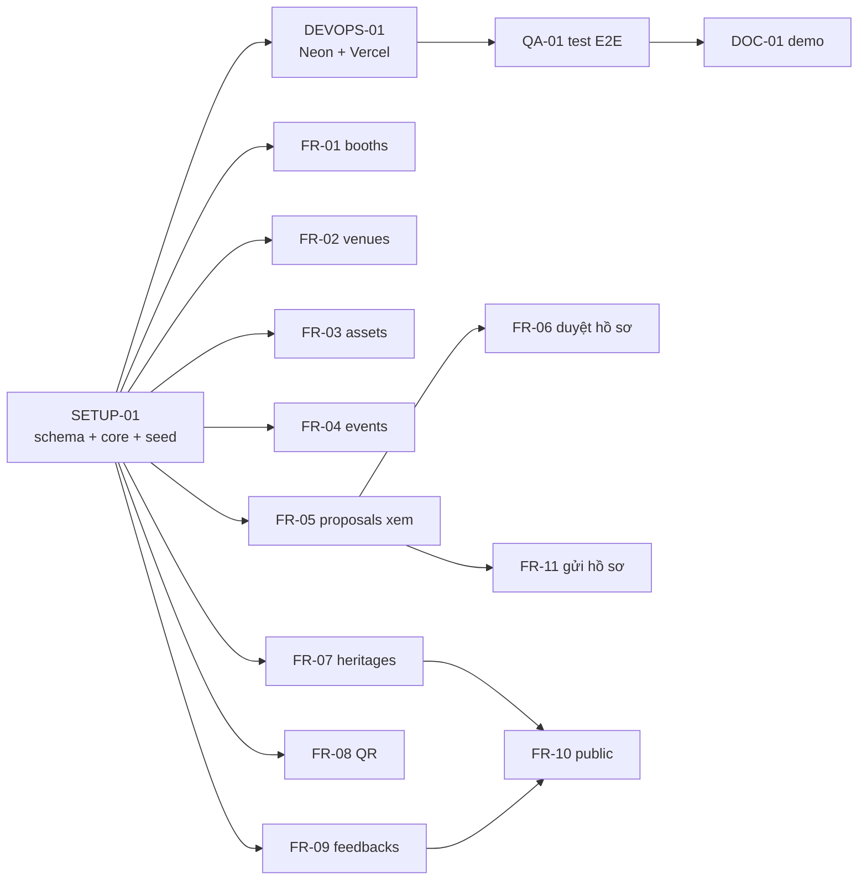

# 03 · Kế hoạch & phân công (tới 19:00 ngày 20/09/2026)

## 1. Vai trò

Chia theo **thư mục module** để mỗi người code trong "vùng" của mình, gần như không đụng nhau. Tên người chỉ là gợi ý dựa trên lịch sử commit – nhóm tự đổi, rồi điền GitHub username vào `.github/backlog.json`.

| Vai trò | Gợi ý | Sở hữu | P0 | P1 / P2 |
|---|---|---|---|---|
| A – trưởng nhóm | Khuyên | core, schema, seed, deploy, merge | SETUP-01, DEVOPS-01 | QA-01, DOC-01, review mọi PR |
| B | Tân (đã viết code phần 3) | heritages, qr, feedbacks | FR-07, FR-08, FR-09 | FR-10 · FR-13, FR-14, FE-01 |
| C | Trí | booths, venues, events | FR-01, FR-02, FR-04 | FE-02 |
| D | Trâm | assets, proposals | FR-03, FR-05, FR-06 | FR-11 · FR-12 |

Ước lượng P0+P1: A ≈ 5.5h (+ review), B ≈ 4h, C ≈ 4.5h, D ≈ 5h.

## 2. Thứ tự và phụ thuộc

SETUP-01 là nút cổ chai: schema cho **cả 9 nhóm API** + router rỗng được tạo sẵn, nên sau khi merge thì 3 người còn lại chạy song song hoàn toàn.

## 3. Lịch làm việc

| Thời gian | A | B | C | D |
|---|---|---|---|---|
| **Tối 19/09** | Merge bộ kit, chạy workflow tạo issue, tạo Neon + gửi chuỗi DB riêng cho từng người, bắt đầu SETUP-01 | SETUP-02 | SETUP-02 | SETUP-02 |
| 08:00–09:30 | Hoàn tất SETUP-01 → PR → merge | Đọc issue, soạn trước zod schema + file `.http` (không cần chờ) | như B | như B |
| 09:30–12:30 | DEVOPS-01, review PR | FR-07, FR-08 | FR-01 → FR-02 | FR-03 → FR-05 |
| **12:30 mốc 1** | Mỗi phần có ≥1 API đã merge và chạy trên Vercel | | | |
| 13:30–16:00 | Review/merge liên tục, QA-01 | FR-09 → FR-10 | FR-04 | FR-06 → FR-11 |
| **16:00 mốc 2 – đóng băng tính năng** | Toàn bộ P0 đã merge. Sau mốc này chỉ sửa lỗi (`fix/…`) | | | |
| 16:00–17:15 | Chạy QA-01 trên bản deploy | Sửa lỗi / P2 nếu xanh | Sửa lỗi / FE-02 | Sửa lỗi / FR-12 |
| 17:15–18:15 | DOC-01: kịch bản demo, báo cáo | Luyện giải thích phần mình | như B | như B |
| 18:15 | Tag `v1.0-demo`, khóa merge | | | |
| 18:30 | Gọi `/api/health`, mở sẵn `/api-docs.html` (đánh thức Neon) | | | |

Họp nhanh 10 phút lúc **09:30, 12:30, 16:00**: mỗi người nói (1) đã merge gì, (2) đang kẹt gì, (3) sẽ xong gì trước mốc sau. Ai kẹt quá 30 phút → gắn nhãn `status: blocked` và nhắn nhóm.

## 4. Definition of Done
- PR có `Closes #<số>`, CI xanh, trưởng nhóm review và squash merge.
- Endpoint có trong `/api-docs.html` và có request mẫu trong `http/<module>.http`.
- Đã gọi thử trên bản **Vercel Preview** của PR (Vercel tự tạo link Preview cho mỗi PR).
- Người làm giải thích được luồng request.

## 5. Rủi ro và phương án dự phòng

| Rủi ro | Dấu hiệu | Xử lý |
|---|---|---|
| SETUP-01 trễ | 10:00 chưa merge | Cả nhóm pair với A; B/C/D viết trước service dạng hàm thuần + zod |
| Không kết nối được Neon | `/api/health` báo lỗi DB | Kiểm tra chuỗi pooled/direct, `sslmode=require`, `pgbouncer=true` (docs/05 mục 6) |
| API trên Vercel Function lỗi | Preview trả 500/404 ở `/api/health` | Deploy cùng Express app lên Render (docs/05), `vercel.json` rewrite `/api/*` sang Render |
| Trễ tiến độ | 14:00 còn >3 FR P0 chưa mở PR | Cắt về "danh sách + tạo mới" cho FR còn lại, bỏ hết P1/P2 |
| Neon đang ngủ lúc demo | Lần gọi đầu chậm vài giây | 18:30 gọi `/api/health` trước |

## 6. Kịch bản demo (7–10 phút)
1. **Giới thiệu kiến trúc (1 phút):** sơ đồ docs/01 mục 3 – một Express app, Prisma, PostgreSQL trên Neon, deploy Vercel (cùng vùng Singapore).
2. **Phần 1 (2 phút) trên `/api-docs.html`:** tạo gian hàng → tìm `q=nha` + lọc `campusId=HCM` → xóa mềm → danh sách không còn. Xóa địa điểm đang dùng → 409.
3. **Phần 2 (2.5 phút):** tạo sự kiện mức "Trọng điểm" → lọc hồ sơ `status=PENDING` theo ngày → trả bổ sung **thiếu ghi chú → 400** → có ghi chú → OK → duyệt lại hồ sơ đã duyệt → 409.
4. **Phần 3 (2.5 phút):** tạo di sản (slug tự sinh) → sửa tên, thử đổi slug → 400 → sinh QR, **quét bằng điện thoại** → lọc feedback `maxRating=2` → PATCH `RESOLVED`.
5. **Mở Neon Console** (tab Tables) hoặc `npx prisma studio` cho thấy dữ liệu thật trong PostgreSQL (30 giây).

## 7. Câu hỏi mentor có thể hỏi
- *Vì sao dùng TypeScript mà không phải Java?* → docs/01 ADR-1.
- *Vì sao PostgreSQL mà không SQL Server?* → docs/01 ADR-2: không có email trường để dùng Azure miễn phí; Prisma giúp đổi DB mà code không đổi.
- *Xóa mềm là gì, sao gian hàng xóa mềm còn địa điểm thì chặn xóa?* → gian hàng cần giữ lịch sử/khôi phục; địa điểm bị sự kiện tham chiếu, xóa sẽ làm hỏng dữ liệu → DB chặn bằng khóa ngoại (NoAction), API trả 409.
- *Sao slug không cho đổi?* → QR đã in ra giấy, đổi slug là QR gãy link (AS01).
- *Domain QR lấy từ đâu?* → biến môi trường `PUBLIC_BASE_URL`, đọc qua `core/config.ts`; đổi domain không phải sửa code.
- *Ghi chú bắt buộc kiểm tra ở đâu?* → zod ở tầng validate (400) + service kiểm tra trạng thái hợp lệ (409); cập nhật và ghi log trong một transaction.
- *Lọc nhiều điều kiện làm thế nào?* → ghép object `where` của Prisma theo từng tham số có mặt (tương đương Specification trong Spring).
- *Code-first hay database-first, vì sao?* → docs/01 ADR-2.
