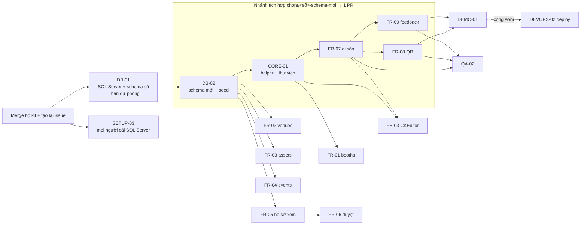

# 03 · Kế hoạch & phân công (tới 19:30 ngày 22/09/2026)

> Thay thế kế hoạch mốc 20/09 (đã lỗi thời). Căn cứ: *Hướng đi dự án sau yêu cầu mới của mentor* (21/09).
> Nguyên tắc: **hoàn thành 3 API demo (FR-07, FR-08, FR-09) trên SQL Server trước**, sau đó làm tiếp 6 API còn lại. Demo local.

## 1. Vai trò (giữ như backlog cũ)

| Vai trò | Người | Sở hữu | P0 | P1 / P2 |
|---|---|---|---|---|
| A – trưởng nhóm | Khuyên (arisdo-29) | schema, seed, core, tài liệu DB, merge, máy demo | DB-01, DB-02, CORE-01, DEMO-01 | QA-02 · DEVOPS-02, CLEAN-02, review mọi PR |
| B | Tân (dwargon73-sketch) | heritages, qr, feedbacks, public, CKEditor | FR-07, FR-08, FR-09 | FE-03 · FR-10 |
| C | Trí (Nguyentri2531) | booths, venues, events | — | FR-02, FR-01, FR-04 |
| D | Trâm (kopslngbtram2110) | assets, proposals | — | FR-03, FR-05, FR-06 · FR-11 |

Cả nhóm: SETUP-03 (cài SQL Server local) **ngay tối 21/09**.

**Đường găng của buổi demo:** DB-02 + CORE-01 (A) → FR-07 → FR-08 → FR-09 (B) → DEMO-01 (A). C và D làm song song, không chặn demo; kịp trước 19:30 thì demo thêm.

## 2. Thứ tự và phụ thuộc

C và D **tạo nhánh từ nhánh tích hợp** (không phải từ `main`) ngay khi A push xong schema + helper, để code trên schema mới mà không phải chờ PR tích hợp merge (docs/04 mục 6).

## 3. Lịch làm việc

| Thời gian | A (Khuyên) | B (Tân) | C (Trí) | D (Trâm) |
|---|---|---|---|---|
| **Tối 21/09** | Merge bộ kit → chạy *Bootstrap backlog* (đóng issue cũ, tạo issue mới) → DB-01 → PR → merge → bắt đầu DB-02 | SETUP-03 (cài SQL Server, tạo DB, chạy bản DB-01). Đọc lại code heritages/qr/feedbacks | SETUP-03. Đọc docs/01 mục 4, docs/02 phần 1–2. Soạn trước zod + `http/*.http` (không phụ thuộc schema) | như C |
| 08:00–09:30 | Hoàn tất DB-02 + CORE-01 trên nhánh tích hợp, push, nhắn nhóm "schema xong" | Pull nhánh tích hợp, `db push --force-reset`, seed, chuẩn bị FR-07 | Như B; tạo nhánh FR-02 từ nhánh tích hợp | Như B; tạo nhánh FR-03 từ nhánh tích hợp |
| **09:30 mốc 0** | Nhánh tích hợp có schema + seed + helper chạy được trên máy A | | | |
| 09:30–12:30 | Hỗ trợ B (người gỡ vướng cho đường găng), review nhánh tích hợp, sửa seed nếu thiếu | FR-07 → FR-08 → FR-09 trên nhánh tích hợp | FR-02 → PR; FR-01 | FR-03 → PR; FR-05 |
| **12:30 mốc 1** | 3 API demo chạy trên Swagger ở máy A và máy B → mở **PR tích hợp** → CI xanh → merge **trước 13:30** | | | |
| 13:30–16:30 | Review/merge PR của C, D (nhắc họ `git merge origin/main`); QA-02; soạn DEMO-01. 15:00 mà mọi thứ xanh mới cân nhắc DEVOPS-02 | FE-03 CKEditor → FR-10 nếu rảnh | FR-04 → PR; hoàn thiện FR-01 → PR | FR-05 → PR; FR-06 → PR |
| **16:30 mốc 2 – đóng băng tính năng** | Chỉ merge PR đã xong. Sau mốc này chỉ sửa lỗi (`fix/…`) | | | |
| 16:30–18:00 | Máy demo: clone sạch, `db push --force-reset`, seed, chạy toàn bộ `http/*.http`; hoàn thiện DEMO-01 | Sửa lỗi, luyện giải thích phần 3 | Sửa lỗi, luyện phần 1–2 của mình | như C |
| 18:00–18:45 | Chạy thử kịch bản demo trọn vẹn 1 lần + luyện Q&A cả nhóm | | | |
| 18:45 | Tag `v2.0-demo`, khóa merge | | | |
| 19:00 | Máy demo mở sẵn Swagger, SSMS Database Diagram, điện thoại quét QR; gọi thử 3 API | | | |
| **19:30** | **Demo** | | | |

Họp nhanh 10 phút lúc **09:30, 12:30, 16:30**: mỗi người nói (1) đã push/merge gì, (2) đang kẹt gì, (3) sẽ xong gì trước mốc sau. Kẹt quá 30 phút → gắn nhãn `status: blocked` và nhắn nhóm.

## 4. Definition of Done
- PR có `Closes #<số>`, CI xanh, trưởng nhóm review và squash merge.
- Endpoint có trong `/api-docs.html` và có request mẫu trong `http/<module>.http` (kèm ca lỗi).
- Đã gọi thử trên **SQL Server local** của mình sau `npm run seed`; tiếng Việt hiển thị đúng dấu trong SSMS/Prisma Studio.
- Không dùng `mode: 'insensitive'`, `@db.VarChar`, `enum`, `Json`; HTML đã sanitize.
- Người làm giải thích được luồng request và ánh xạ JSON ↔ bảng.

## 5. Rủi ro và phương án dự phòng

| Rủi ro | Dấu hiệu | Xử lý |
|---|---|---|
| Thành viên chưa cài được SQL Server | Tối 21/09 chưa comment "xong" ở SETUP-03 | A hỗ trợ qua màn hình; máy Mac chip M dùng Docker + Rosetta (docs/05 mục 2); đường cùng: code trước, test chung trên máy A |
| DB-02 trễ | 09:30 chưa có schema trên nhánh tích hợp | Cả nhóm pair với A; C/D tiếp tục soạn zod + `.http`; B viết trước `toDto()` theo docs/01 mục 4.5 |
| Port phần 3 trễ | 12:30 chưa chạy được FR-07 | A nhảy vào cùng B (A làm FR-09, B làm FR-07/08). **14:30 vẫn chưa được → demo bằng bản DB-01 trên `main`** (3 API chạy trên SQL Server với schema cũ) + trình bày schema mới qua SSMS Diagram |
| `db push` lỗi trên SQL Server | Lỗi *cascade paths*, P2002 với NULL, lỗi kiểu | docs/05 mục 7; kiểm tra quy tắc AGENTS.md mục 3.2 |
| Conflict khi C/D merge `main` sau PR tích hợp | Conflict ở `prisma/`, `server/core/`, `package*.json` | Các file này không phải của C/D → lấy bản của `main` (docs/04 mục 6) |
| Trễ tiến độ chung | 15:00 còn > 3 FR P1 chưa mở PR | Cắt về "danh sách + tạo mới" cho FR còn lại, bỏ P2 |
| Máy demo hỏng lúc 19:00 | — | Máy B chuẩn bị song song, đã seed và chạy được Swagger |

## 6. Kịch bản demo (8–10 phút, trên máy A)
1. **Database (2 phút) – SSMS → Database Diagrams:** chỉ khung nội dung chung (`ItemCategories`, `Items`, `ItemAttributes`, `ItemAttributeMappings`, `Pictures`, `ItemPictureMappings`, `WebsiteAttributes`) tương ứng từng bảng mẫu của mentor; bảng nghiệp vụ (`Venues`, `Assets`, `Events`, `Proposals` ≈ Orders, `ProposalItems` ≈ OrderItems…). Nêu nguyên tắc: cột thật để lọc/ràng buộc, thuộc tính động để hiển thị.
2. **Phần 3 trên `/api-docs.html` (4 phút):**
   - `POST /api/admin/heritages` với `content_vi` là HTML → slug tự sinh. Mở SSMS: bản ghi trong `Items`, nguồn trong `ItemAttributeMappings`, ảnh trong `ItemPictureMappings`.
   - `PUT` thử đổi `slug` → **400**. `DELETE` → `Deleted = 1`, danh sách không còn, góp ý vẫn giữ.
   - `GET /api/admin/heritages/{slug}/qr` → sửa `Value` của `QR_BASE_URL` trong `WebsiteAttributes` → gọi lại, URL trong QR đổi domain (cấu hình không nằm trong code). **Quét bằng điện thoại.**
   - `GET /api/admin/feedbacks?heritageId=general&maxRating=2&status=PENDING` → `PATCH …/status` `RESOLVED`.
3. **Phần 1–2 (2–3 phút, nếu đã merge):** tạo gian hàng → tìm `q=nha nam` ra "Nhã Nam" + lọc `campusId=HCM` → xóa mềm. Hồ sơ: lọc `status=PENDING` → `request-supplement` **thiếu note → 400** → có note → OK → duyệt lại hồ sơ đã duyệt → **409**.
4. **CKEditor (1 phút, nếu FE-03 xong):** sửa nội dung di sản trên màn admin → lưu → HTML trong cột `Content`.
5. **Hỏi mentor:** dùng tiền tố `Item` hay giữ `Product`? (và ghi lại các câu hỏi cho khách ở mục 8.)

## 7. Câu hỏi mentor có thể hỏi
- *Vì sao không tạo bảng Heritages, Booths riêng mà dùng Items?* → khung nội dung chung theo mẫu mentor: di sản, gian hàng, điểm bản đồ đều là "nội dung hiển thị" có tên, mô tả, ảnh, song ngữ; khác nhau chỉ ở vài trường hiển thị → thuộc tính động. Thêm loại mới không cần sửa schema (docs/01 ADR-3).
- *Vậy sao Venues, Assets, Proposals lại là bảng riêng?* → có quy tắc nghiệp vụ: sức chứa, số lượng thiết bị, lịch, trạng thái duyệt → cần cột thật để lọc và kiểm tra ràng buộc, khóa ngoại để chặn xóa.
- *Lưu số đầu sách trong thuộc tính động thì lọc/sắp xếp thế nào?* → hiện chỉ để hiển thị nên đặt ở thuộc tính; nếu BQL cần lọc theo số sách thì chuyển thành cột thật (đúng nguyên tắc).
- *Xóa mềm làm thế nào?* → cột `Deleted`; service luôn lọc `Deleted: false`; địa điểm/thiết bị thì chặn xóa bằng khóa ngoại (`NoAction`) → API trả 409.
- *Slug sao không cho đổi?* → QR đã in ra giấy, đổi slug là QR gãy link (AS01).
- *Domain QR lấy từ đâu?* → bảng `WebsiteAttributes` (`QR_BASE_URL`), dự phòng biến môi trường `PUBLIC_BASE_URL`; đổi domain không sửa code.
- *Vì sao `NVarChar` mà không `VarChar`?* → `VarChar` không lưu Unicode, tiếng Việt thành "?". Nội dung CKEditor dùng `NVarChar(Max)`.
- *CKEditor gửi HTML, có nguy cơ XSS không?* → sanitize ở server trước khi lưu (`core/html.ts`), chỉ giữ thẻ an toàn.
- *Đăng ký tổ chức không cần đăng nhập, chống spam thế nào?* → xác nhận email, giới hạn số đơn theo email/IP (đọc từ cấu hình), captcha khi cần; BQL duyệt là chốt cuối (ADR-5).
- *Code-first hay database-first?* → code-first với Prisma: `schema.prisma` trong git, review như code, `prisma db push` tạo bảng; sơ đồ vẫn xem được trong SSMS.
- *Ghi chú bắt buộc kiểm tra ở đâu?* → zod ở tầng validate (400) + service kiểm tra trạng thái (409); cập nhật có điều kiện trạng thái hiện tại để hai người duyệt cùng lúc không ghi đè nhau.
- *Sao thông tin đơn vị tổ chức nằm luôn trong Proposals, không có bảng Organizers?* → giống `Orders` lưu thông tin người nhận: hiện đơn vị không có tài khoản, mỗi hồ sơ tự mang thông tin liên hệ; trường riêng theo loại chỉ có mã số thuế → một cột. Khi làm cổng tài khoản sẽ **thêm** bảng `Organizers` + cột `OrganizerId`, không phá dữ liệu cũ (docs/01 ADR-7).
- *Duyệt nhiều lần thì biết lịch sử không?* → hiện lưu lần duyệt gần nhất (`ReviewNote`, `ReviewedAt`, `ReviewedBy`), đủ cho luồng trả bổ sung → duyệt. Cần kiểm toán thì thêm bảng `ProposalReviewLogs`.
- *Sao 14 bảng?* → 7 bảng khung nội dung + `Proposals`/`ProposalItems` theo khuôn mentor, chỉ thêm 5 bảng nghiệp vụ có ràng buộc thật (Campuses, Venues, Assets, Events, Feedbacks). Bản nháp đầu 19 bảng, đã bỏ những bảng chưa có nhu cầu thật.

## 8. Việc còn mở (ghi lại, hỏi đúng người)
- **Mentor:** tiền tố `Item` hay giữ `Product` trong tên bảng.
- **Khách (BQL):** giới hạn số đơn đề xuất và quy mô theo loại đơn vị; xác nhận cá nhân được đề xuất; "số lượng sách" là số đầu sách hay số bản.
- **Nhóm:** nơi đặt SQL Server trên cloud nếu deploy (docs/05 mục 8).
