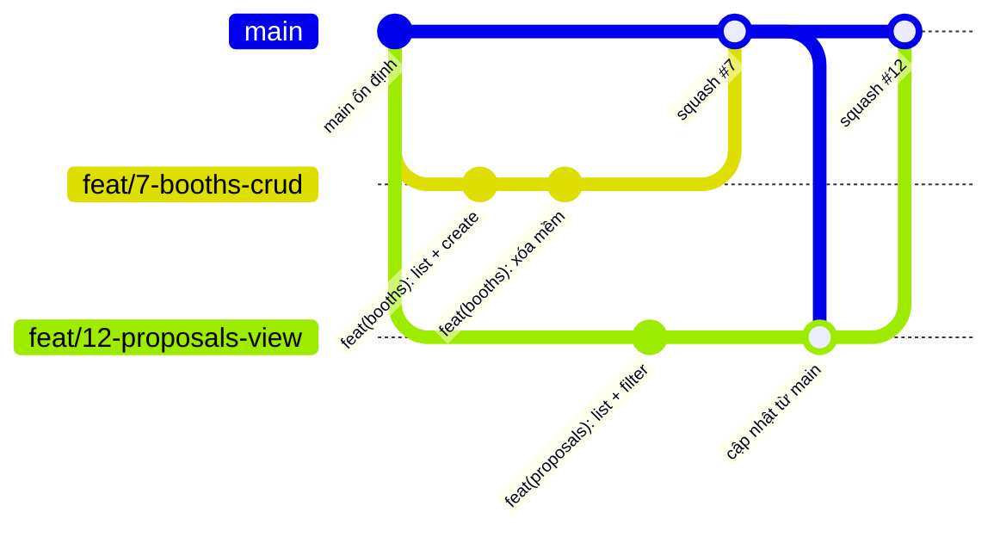
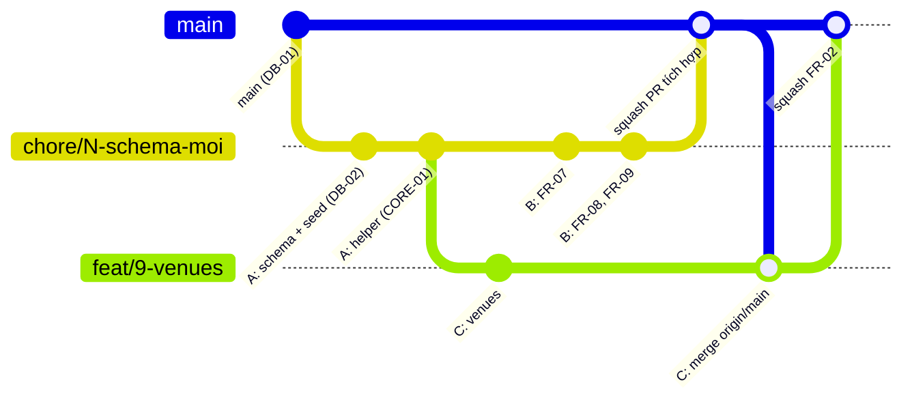

# 04 · Làm việc với Git & GitHub cho nhóm 4 người

## 1. Cài đặt một lần (mỗi người)
```bash
git config --global user.name "Nguyen Viet Tan"
git config --global user.email "email-dang-ky-github@..."   # PHẢI trùng email GitHub để commit hiện đúng avatar
git config --global core.autocrlf true      # Windows  (macOS/Linux dùng: input)
git config --global pull.rebase false       # git pull = merge, dễ hiểu cho người mới
git config --global init.defaultBranch main
git clone https://github.com/arisdo-29/duong-sach-project.git
```
Repo có `.gitattributes` để thống nhất kiểu xuống dòng → hết lỗi "cả file bị đổi" khi Windows và macOS cùng sửa.

## 2. Dọn repo (trưởng nhóm, đã làm 19/09 – kiểm tra lại)
1. **Settings → Branches** cho `main`: *Require a pull request before merging*, *Require status checks: CI*. Không ai push thẳng `main`.
2. **Settings → General → Pull Requests**: bật *Allow squash merging*, bật *Automatically delete head branches*.
3. Nhánh cũ đã merge (`chore/5-setup-core`, `feat/14-…`, `feat/15-…`, `feat/16-…`, `feat/29-…`, `feat/30-…`, `chore/playwright-e2e-setup`) và `connect_gemini_github`: hỏi chủ nhánh rồi xóa (CLEAN-02).

## 3. Mô hình nhánh: GitHub Flow



- `main` luôn chạy được (`npm run check` xanh, `db push` + `seed` chạy được trên SQL Server local).
- Mỗi issue = một nhánh ngắn (vài giờ), tách từ `main` mới nhất.
- Tên nhánh `<loại>/<số-issue>-<mô-tả-ngắn>`: `feat/7-booths-crud`, `fix/15-feedback-filter`, `chore/1-setup`, `docs/20-demo`. Có số issue ở đầu → nhãn trạng thái của issue tự cập nhật.

## 4. Commit message (Conventional Commits)
`<loại>(<module>): <mô tả tiếng Việt> (#<issue>)`

| Loại | Khi nào | Ví dụ |
|---|---|---|
| `feat` | Tính năng / API mới | `feat(booths): thêm lọc theo cơ sở (#7)` |
| `fix` | Sửa lỗi | `fix(feedbacks): bỏ fallback id test (#15)` |
| `refactor` | Sửa cấu trúc, không đổi hành vi | `refactor(heritages): tách service (#13)` |
| `test` | Thêm test / file .http | `test(proposals): thêm ca từ chối thiếu ghi chú (#12)` |
| `docs` | Tài liệu | `docs: cập nhật hợp đồng API events (#10)` |
| `chore` | Cấu hình, dependency | `chore: thêm script check (#1)` |

Commit nhỏ, mỗi commit một ý, commit **sau khi** `npm run check` xanh.

## 5. Quy trình một task

| Bước | Dòng lệnh | IntelliJ | VS Code / Antigravity |
|---|---|---|---|
| 1. Lấy `main` mới | `git switch main && git pull` | Git → Pull | Source Control → … → Pull |
| 2. Tạo nhánh | `git switch -c feat/7-booths-crud` | Nhánh ở góc dưới phải → New Branch | Tên nhánh ở góc dưới trái → Create new branch |
| 3. Code + test | `npm run check` | Terminal | Terminal |
| 4. Commit | `git add server/modules/booths http/booths.http` rồi `git commit -m "feat(booths): ... (#7)"` | Commit (Ctrl+K), chỉ tick file của mình | Tab Source Control, `+` từng file, nhập message |
| 5. Đẩy lên | `git push -u origin feat/7-booths-crud` | Push (Ctrl+Shift+K) | Publish Branch |
| 6. Mở PR | `gh pr create --fill` hoặc trên web | GitHub → Create Pull Request | Extension GitHub Pull Requests |
| 7. Sau review | Trưởng nhóm bấm **Squash and merge** | | |

Luôn **xem lại danh sách file trước khi commit**: không có `.env`, `node_modules/`, `dist/`, file `.db`/`.mdf`/`.bak`, file của module khác.

## 6. Cập nhật nhánh khi `main` đã thay đổi
Làm mỗi khi có PR khác vừa merge và **bắt buộc trước khi mở PR**:
```bash
git fetch origin
git merge origin/main        # không dùng rebase, không force push
npm install                  # nếu package.json vừa đổi
npx prisma generate          # nếu schema.prisma vừa đổi
npx prisma db push           # nếu schema.prisma vừa đổi (đổi lớn: --force-reset rồi npm run seed)
npm run check
git push
```

### Nhánh tích hợp đợt 22/09 (chỉ dùng một lần)
Đổi schema sang khuôn mentor làm code phần 3 cũ không biên dịch được, nên **DB-02, CORE-01, FR-07, FR-08, FR-09 dùng chung một nhánh** và vào `main` bằng **một PR**:



1. **A** tạo nhánh `chore/<số DB-02>-schema-moi` từ `main`, push commit schema + seed, rồi commit helper (CORE-01).
2. **B** không tạo nhánh riêng: `git fetch && git switch chore/<số>-schema-moi`, commit FR-07/08/09 lên chính nhánh này. A và B sửa **file khác nhau** (A: `prisma/`, `server/core/`, `campuses`, `package*.json`; B: `heritages`, `qr`, `feedbacks`, `public`, `http/` của B) nên không đụng nhau. Trước mỗi lần push: `git pull`.
3. **C, D** tạo nhánh việc của mình **từ nhánh tích hợp**: `git switch chore/<số>-schema-moi && git pull && git switch -c feat/<số>-venues-crud`. Khi nhánh tích hợp có commit mới cần dùng: `git merge origin/chore/<số>-schema-moi`.
4. A mở **một PR** từ nhánh tích hợp vào `main`, mô tả ghi `Closes #DB-02 Closes #CORE-01 Closes #FR-07 Closes #FR-08 Closes #FR-09` (thay bằng số thật). Squash merge.
5. Sau khi PR tích hợp merge, **C, D** chạy `git fetch && git merge origin/main`. Nếu conflict ở file **không phải của mình** (`prisma/`, `server/core/`, `package*.json`, module của B): lấy bản của `main`:
   ```bash
   git checkout --theirs prisma/schema.prisma server/core/ package.json package-lock.json
   npm install && npx prisma generate
   git add . && git commit
   ```
   Rồi mở PR vào `main` như bình thường (PR chỉ còn file module của mình).

## 7. Tránh xung đột
1. **Mỗi người chỉ sửa thư mục module của mình** (bảng chủ sở hữu trong AGENTS.md).
2. **File dùng chung chỉ trưởng nhóm sửa:** `prisma/schema.prisma`, `prisma/seed.ts`, `server/routes.ts`, `server/core/*`, `server/app.ts`, `package.json`, `package-lock.json`, `vite.config.ts`, `vercel.json`, `.env.example`, `AGENTS.md`, `CLAUDE.md`, `docs/`. Cần đổi → nhắn A.
3. **Không cài thư viện riêng lẻ.** `npm install xyz` đổi `package-lock.json` → xung đột khó gỡ. Cần thư viện → A cài một lần cho cả nhóm.
4. PR nhỏ, merge thường xuyên (mỗi 2–3 giờ). Nhánh sống càng lâu càng dễ xung đột.
5. Không format lại cả file (tắt "Reformat code" khi commit trong IntelliJ) → chỉ đổi đúng dòng cần đổi.

## 8. Khi có xung đột
Git đánh dấu trong file:
```
<<<<<<< HEAD            ← phần của bạn
...
=======
...
>>>>>>> origin/main     ← phần đã có trên main
```
- **IntelliJ:** Git → Resolve Conflicts → Merge: 3 cột (của bạn | kết quả | của main), bấm `>>` / `<<` để lấy từng đoạn.
- **VS Code / Antigravity:** mở file → *Resolve in Merge Editor* → Accept Current / Incoming / Both.
- **Claude Code:** `Có conflict khi merge origin/main. Giải thích từng khối, đề xuất cách giữ, chờ mình xác nhận.`
- Xong: `git add <file>` → `git commit` → `npm run check` → `git push`.
- **Riêng `package-lock.json`:** không sửa tay. `git checkout --theirs package-lock.json && npm install && git add package-lock.json`.

## 9. Sự cố thường gặp
| Tình huống | Cách cứu |
|---|---|
| Lỡ commit trên `main` (chưa push) | `git switch -c feat/x-ten` (commit đi theo nhánh mới) → `git branch -f main origin/main` (đưa `main` về như trên GitHub) |
| Muốn bỏ commit cuối (chưa push) | `git reset --soft HEAD~1` (giữ nguyên code) |
| Lỡ commit file không nên (`.env`) | `git rm --cached .env` → commit. Nếu **đã push mật khẩu**: đổi mật khẩu login SQL Server ngay (`ALTER LOGIN sa WITH PASSWORD = '...'`) và báo trưởng nhóm |
| Sửa lung tung muốn về trạng thái commit gần nhất | `git restore .` (mất thay đổi chưa commit!) |
| Push bị từ chối (non-fast-forward) | `git pull` rồi push lại. **Không** `--force` |

## 10. Lệnh nhanh
```bash
git status                    # đang ở nhánh nào, file nào đổi
git log --oneline --graph -15 # lịch sử
git diff                      # xem thay đổi chưa add
gh issue list --assignee @me  # việc của tôi
gh pr status                  # PR của tôi
```
